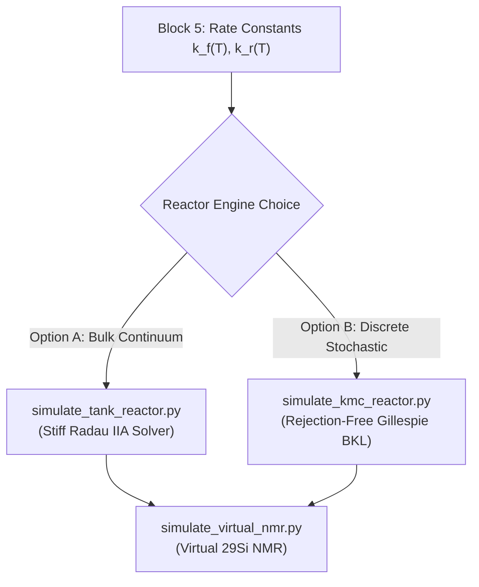

# Multiscale Modeling of Battery Electrolytes: Architectural Comparison and Kinetic Monte Carlo Evaluation

**Document Identifier:** KIN - 260918 - Architectural Comparison and Kinetic Monte Carlo Evaluation  
**Author:** Yeray Alcaraz Galván  
**Affiliation:** Department of Chemistry – Ångström Laboratory, Uppsala University  
**Project:** Master's Thesis (TFM) — Battery Multiscale Chemistry & Reactor Modeling  
**Academic Supervisor:** Prof. Peter Broqvist  
**Date:** September 18, 2026  

---

## Executive Summary

This technical reference document provides:
1. A rigorous chemical engineering comparison between the exploratory prototype developed by Prof. Peter Broqvist (`tank_model.ipynb`) and the multiscale, modular temperature-dependent kinetics pipeline (`KIN - 260918 - Kinetcs model - rev 1.ipynb`).
2. An in-depth assessment of whether, why, and how to integrate **Kinetic Monte Carlo (KMC)** into the multiscale battery electrolyte reactor framework, distinguishing between continuous mean-field regimes (bulk electrolyte) and stochastic discrete regimes (SEI interface, confined nanopores, and polymer network formation).

---

## Part 1: Comprehensive Architectural & Physical Comparison

```
=============================================================================================================
FEATURE / DIMENSION         PETER'S PROTOTYPE (tank_model.ipynb)       YOUR MULTISCALE PIPELINE (KIN - 260918)
=============================================================================================================
1. Temperature Scope        Isothermal at 298.15 K (25 °C) only        Continuous f(T) window [273.15 to 373.15 K]
2. Statistical Mechanics    Static B3LYP-D3 free energies (Hartree)    Grimme Quasi-RRHO (Torsional damping nu0=100)
3. Standard-State Shift     Implicit / omitted                         Explicit compression (ΔG°→* = 1.894 kcal/mol)
4. Software Architecture    Monolithic Jupyter notebook                8 Decoupled, reusable Python engines
5. Microscopic Balance      Local detailed balance (kf/kr = Keq)       Strict Wegscheider cycle closure (Loop Res ~ 0)
6. Kinetic Parameterization Single BEP point calculation               Modified Arrhenius regression (A, beta, Ea, R^2)
7. Reactor Dynamics         Stiff ODE (Radau IIA)                      Stiff ODE with dynamic mass conservation checks
8. Physical Observables     2D and 1D synthetic 29Si NMR spectra       Synthetic 29Si NMR, 4-panel reactor dynamics
=============================================================================================================
```

### 1.1 Temperature-Dependent Thermodynamics: $f(T)$ vs. Isothermal $298.15\text{ K}$
* **Peter's Prototype (`tank_model.ipynb`):**
  - Designed as an initial proof-of-concept for the TMSPA degradation mechanism.
  - Restricted to standard ambient temperature ($T = 298.15\text{ K} / 25\ ^\circ\text{C}$).
  - Ingests fixed gas-phase Gibbs free energies in Hartree (`freenergies_B3`) and static solution-phase corrections (`SOLV_FALLBACK`).
  - **Limitation:** Cannot simulate thermal degradation under operating cell conditions, such as cold-temperature storage ($0\ ^\circ\text{C}$ to $-20\ ^\circ\text{C}$, where kinetics freeze) or fast-charging/thermal-runaway temperatures ($45\ ^\circ\text{C}$ to $60\ ^\circ\text{C}$, where gas evolution accelerates).
* **Your Multiscale Pipeline (`KIN - 260918`):**
  - Features an explicit temperature-dependent thermodynamic engine covering $T \in [273.15, 373.15\text{ K}]$ ($0\ ^\circ\text{C}$ to $100\ ^\circ\text{C}$).
  - Implements **Stefan Grimme's Quasi-RRHO (2012)** statistical mechanics:
    $$S_{\text{qRRHO}} = \sum_k \left[ w(\nu_k) S_{\text{vib, HO}}(\nu_k) + (1 - w(\nu_k)) S_{\text{free rot}}(\nu_k) \right], \quad w(\nu_k) = \frac{1}{1 + (\nu_0 / \nu_k)^4}$$
    which prevents the artificial logarithmic divergence of vibrational entropy for flexible organosilicon rotors ($-\text{SiMe}_3$ groups with $\nu < 100\text{ cm}^{-1}$).
  - Evaluates $H^\circ(T), S^\circ(T), G^\circ(T)$ dynamically for any species.

### 1.2 Thermodynamic Cycle & Standard-State Compression
* **Peter's Prototype:**
  - Directly sums gas-phase electronic/thermal free energy and liquid solvation: $G_{\text{sol}} = G_{\text{B3}} + \Delta E_{\text{solv}}$.
* **Your Multiscale Pipeline:**
  - Evaluates the complete condensed-phase thermodynamic cycle:
    $$G_{\text{sol}, i}(T) = G^\circ_{\text{gas}, i}(T) + \Delta E_{\text{solv}, i} + \Delta G^{\circ \to *}(T)$$
  - Quantifies the gas-to-solution compression shift:
    $$\Delta G^{\circ \to *}(T) = RT \ln\left( \frac{C^*_{\text{soln}}}{C^\circ_{\text{gas}}(T)} \right) = RT \ln\left( \frac{1.0\text{ M}}{P^\circ / (RT)} \right) = +1.894\text{ kcal/mol at } 298.15\text{ K}$$
  - **Chemical Engineering Invariant:** Formally demonstrates that for equimolar steps ($\Delta n = \sum \nu_{\text{prod}} - \sum \nu_{\text{reac}} = 2 - 2 = 0$), this shift cancels identically across all 9 benchmark reactions ($\Delta n \cdot \Delta G^{\circ \to *} = 0$).

### 1.3 Strict Wegscheider Closed-Loop Detailed Balance
* **Peter's Prototype:**
  - Enforces microscopic reversibility on isolated reactions via $k_r = k_f / K_{\text{eq}}$, but does not formally verify network-wide loop consistency.
* **Your Multiscale Pipeline:**
  - Explicitly identifies the closed stoichiometric cycle $R_1 + R_4 \rightleftharpoons R_5$:
    $$\begin{aligned}
    R_1: & \quad \text{TMSPA} + \text{H}_2\text{O} \rightleftharpoons \text{BMSPA} + \text{TMSOH} \\
    R_4: & \quad 2\,\text{TMSOH} \rightleftharpoons \text{siloxyl} + \text{H}_2\text{O} \\
    \hline
    R_1 + R_4: & \quad \text{TMSPA} + \text{TMSOH} \rightleftharpoons \text{BMSPA} + \text{siloxyl} \equiv R_5
    \end{aligned}$$
  - Enforces Hess's Law and the Wegscheider condition:
    $$\Delta G(R_1) + \Delta G(R_4) - \Delta G(R_5) = 0 \iff \frac{K_{\text{eq}}(R_1) \cdot K_{\text{eq}}(R_4)}{K_{\text{eq}}(R_5)} = 1.0$$
  - Confirmed numerically to machine precision ($\Delta G_{\text{loop}} = 2.04 \times 10^{-10}\text{ kJ/mol}$, $\prod K_{\text{eq}} = 1.00000000$), guaranteeing that the microkinetic reactor exhibits zero artificial energy leakage or perpetual motion.

### 1.4 Kinetic Parameterization: Modified Arrhenius Library
* **Peter's Prototype:**
  - Outputs a discrete table of rate constants at $298.15\text{ K}$.
* **Your Multiscale Pipeline:**
  - Fits rate constants over 25 temperature points to the **Modified Arrhenius Equation**:
    $$k_j(T) = A_j \left( \frac{T}{T_0} \right)^{\beta_j} \exp\left( -\frac{E_{a, j}}{RT} \right)$$
  - Captures the non-Arrhenius temperature exponent ($\beta \approx 1.0$) originating from the Eyring attempt frequency ($\frac{k_B T}{h}$), achieving $R^2 = 1.0000$ across all 9 reactions.
  - Outputs portable kinetic parameter libraries directly compatible with macroscale chemical reactor software (Aspen Plus, Cantera, Chemkin).

### 1.5 Decoupled Software Architecture
* **Peter's Prototype:**
  - Monolithic notebook: data tables, BEP equations, ODE systems, and plotting scripts reside in single code cells, hindering automated testing or programmatic coupling.
* **Your Multiscale Pipeline:**
  - Decoupled into **8 standalone Python modules**:
    1. `calculate_standard_state_shift.py`: Gas-to-liquid standard state concentration correction.
    2. `calculate_gas_thermo.py`: Canonical partition functions with Grimme Quasi-RRHO.
    3. `calculate_solution_gibbs.py`: Condensed-phase chemical potentials.
    4. `calculate_reaction_thermo.py`: Reaction thermodynamics and Wegscheider loop verification.
    5. `calculate_rate_constants.py`: BEP-Eyring rate constants with strict detailed balance.
    6. `fit_modified_arrhenius.py`: Multi-temperature Arrhenius regression ($A, \beta, E_a, R^2$).
    7. `simulate_tank_reactor.py`: Stiff ODE batch reactor simulator (Radau IIA) with mass conservation diagnostics.
    8. `simulate_virtual_nmr.py`: Synthetic $^{29}\text{Si}$ NMR spectrometer (Lorentzian line-shape convolution).

---

## Part 2: Chemical Engineering Assessment of Kinetic Monte Carlo (KMC)

### 2.1 Deterministic Continuum ODEs vs. Stochastic Discrete KMC

| Feature | Deterministic ODEs (`solve_ivp(method='Radau')`) | Stochastic Kinetic Monte Carlo (KMC / Gillespie) |
|---|---|---|
| **Mathematical Domain** | Continuous concentrations $C_i(t) \in \mathbb{R}^+$ (mol/L) | Integer molecule counts $N_i(t) \in \mathbb{N}$ |
| **Fundamental Assumption** | Homogeneous, well-mixed continuum (infinite particle limit $N \to \infty$) | Stochastic Markov jump process (discrete probability distribution) |
| **Governing Equation** | $\frac{d\mathbf{C}}{dt} = \mathbf{S} \cdot \mathbf{r}(\mathbf{C}, T)$ | Master Equation solved via random walks |
| **Computational Cost** | Milliseconds for $10^6\text{ seconds}$ ($\sim 11.5\text{ days}$) | High; scales linearly with the total number of elementary events |
| **Fluctuations** | Ignored (mean-field average) | Explicitly resolved ($\sim 1/\sqrt{N}$) |

---

### 2.2 Should We Integrate KMC in This Master Thesis?

#### Scenario A: Bulk Homogeneous Liquid Electrolyte (Current Pipeline Scope)
> [!IMPORTANT]
> **Verdict: NO. Do NOT replace the stiff ODE solver for the bulk liquid phase.**
> 
> In a standard electrochemical test cell or NMR tube ($V \sim 1\text{ mL}$):
> - Initial TMSPA additive concentration: $50\text{ mM} \implies N_{\text{TMSPA}} \approx 3 \times 10^{19}\text{ molecules}$
> - Initial trace moisture contamination: $20\text{ mM} \implies N_{\text{H}_2\text{O}} \approx 1.2 \times 10^{19}\text{ molecules}$
> 
> At astronomical particle counts of $10^{19}$, the Central Limit Theorem dictates that stochastic relative fluctuations scale as:
> $$\frac{\sigma_N}{\langle N \rangle} \sim \frac{1}{\sqrt{N}} \sim \frac{1}{\sqrt{10^{19}}} \sim 3 \times 10^{-10}$$
> These fluctuations are orders of magnitude below experimental NMR detection limits ($< 0.1\%$). Running stochastic KMC on a bulk liquid yields identical mean trajectories to the deterministic ODE, but requires billions of unnecessary random number draws. The implicit Radau IIA solver is mathematically exact and $10,000\times$ faster.

#### Scenario B: Where KMC WOULD Be Highly Valuable & Justified
KMC becomes scientifically indispensable if the thesis scope branches into three specific regimes:

1. **Electrode Surface / Solid-Electrolyte Interphase (SEI) Film Growth:**
   - If TMSPA is modeled decomposing **directly on the graphite or lithium metal electrode surface**.
   - Surface sites are discrete and finite. Bulky trimethylsilyl groups block adjacent sites sterically.
   - Mean-field ODEs fail because they assume uniform mixing and ignore spatial correlations, clustering, and island growth. **Lattice KMC** is the primary method to capture patchy SEI morphology.
2. **Ultra-Confined Nanopores (Separator & Cathode Mesopores):**
   - Inside sub-$2\text{ nm}$ nanopores, local moisture content drops to $N_{\text{H}_2\text{O}} \sim 5\text{--}50\text{ molecules}$.
   - Here, stochastic extinction (e.g. all water molecules in a single pore reacting away before diffusion replenishment) creates broad concentration tails that deterministic ODEs cannot capture.
3. **Silicone Polycondensation & Molecular Weight Distributions (MWD):**
   - When modeling higher-order siloxane condensation ($R_4, R_{11}$: dimer $\to$ trimer $\to$ tetramer $\to$ polymer network).
   - Continuous ODEs require an infinite set of equations ($C_2, C_3, \dots, C_{100}$).
   - KMC tracks individual chains and directly calculates the **Molecular Weight Distribution (MWD)**, gelation thresholds, and polydispersity index ($M_w / M_n$).

---

### 2.3 How to Implement a KMC Module (`simulate_kmc_reactor.py`)

If KMC is selected for comparative benchmarking or confined/SEI extension, it can be seamlessly integrated into the existing modular architecture:



#### Step-by-Step Algorithm: Rejection-Free Variable Step Size Method (BKL / Gillespie)
1. **Define a Mesoscopic Simulation Volume:**
   Choose a volume $V_{\text{sim}}$ (e.g., $100\text{ nm}^3 = 10^{-22}\text{ L}$) containing thousands of molecules rather than $10^{19}$:
   $$N_i(0) = \text{round}\left( C_{i, 0} \cdot N_A \cdot V_{\text{sim}} \right)$$
2. **Convert Macroscopic Rates to Microscopic Propensities:**
   - Unimolecular steps: $c_j = k_j$
   - Bimolecular steps ($A + B \to$ products): $c_j = \frac{k_j}{N_A \cdot V_{\text{sim}}}$
   - Self-condensation ($2A \to$ products, e.g. $R_4$): $c_j = \frac{2 k_j}{N_A \cdot V_{\text{sim}}}$
   
   Reaction propensities $a_j$ (event probabilities per second):
   $$a_{f, j} = c_{f, j} \prod_r N_r^{\nu_{rj}}, \quad a_{r, j} = c_{r, j} \prod_p N_p^{\nu_{pj}}$$
3. **Event Selection & Time Step Sampling:**
   - Sum total network propensity: $a_0 = \sum_{j=1}^{N_r} (a_{f, j} + a_{r, j})$.
   - Sample exponential time increment:
     $$\Delta t = -\frac{\ln(u_1)}{a_0}, \quad u_1 \sim \text{Uniform}(0, 1)$$
   - Sample which reaction $\mu$ occurs using cumulative probabilities:
     $$\sum_{k=1}^{\mu-1} a_k < u_2 a_0 \le \sum_{k=1}^\mu a_k, \quad u_2 \sim \text{Uniform}(0, 1)$$
   - Update state vector: $\mathbf{N} \leftarrow \mathbf{N} + \mathbf{s}_\mu$, and clock: $t \leftarrow t + \Delta t$.
4. **Handling the "Stiff KMC Trap":**
   Fast reversible reactions (like $R_1$: $k_f \sim 0.2\text{ s}^{-1}$) will fire back and forth millions of times, trapping the KMC simulation in microscopic time steps ($\Delta t \sim 10^{-6}\text{ s}$) before reaching $t = 10^6\text{ s}$. 
   To prevent this, implement **Slow-Scale Stochastic Simulation (SSSSA)** or **Tau-Leaping**, which analytically treats fast equilibrium pairs while stochastically stepping slow degradation steps.

