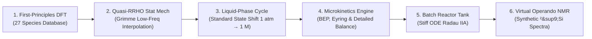

# KIN: Multiscale Microkinetics & Reactor Dynamics for Battery Electrolyte Scavengers

[](https://www.python.org/)
[]()
[]()

A multiscale chemical engineering simulation platform linking **first-principles quantum chemistry (DFT)** to **macroscopic batch reactor kinetics** and **operando $^{29}\text{Si}$ NMR spectroscopy**. Developed as part of the **BatteryAsTank** master's thesis project at Uppsala University.

---

## Multiscale Architecture



---

## Chemical System: TMSPA Scavenging Mechanism

In lithium-ion batteries using $\text{LiPF}_6$ in alkyl carbonate solvents, trace water contamination ($10\text{--}50\text{ ppm}$) triggers autocatalytic hydrolysis:

$$\text{LiPF}_6 \rightleftharpoons \text{LiF} + \text{PF}_5$$
$$\text{PF}_5 + \text{H}_2\text{O} \longrightarrow \text{POF}_3 + 2\,\text{HF}$$

The generated hydrofluoric acid ($\text{HF}$) dissolves the solid electrolyte interphase (SEI) and corrodes cathode active materials.

**Tris(trimethylsilyl) phosphite / phosphate (TMSPA)** acts as an electrochemically active sacrificial scavenger. Through oxophilic nucleophilic substitution at the silicon centers, TMSPA consumes moisture and acidic fluoride species:

$$\text{P-O-SiMe}_3 + \text{H}_2\text{O} \longrightarrow \text{P-O-H} + \text{Me}_3\text{Si-OH (TMSOH)}$$
$$2\,\text{Me}_3\text{Si-OH} \rightleftharpoons \text{Me}_3\text{Si-O-SiMe}_3 \text{ (HMDSO)} + \text{H}_2\text{O}$$
$$\text{Me}_3\text{Si-OH} + \text{HF} \longrightarrow \text{Me}_3\text{Si-F (TMSF)} + \text{H}_2\text{O}$$

This platform models the non-linear coupling, reaction rates, and species evolution across variable operating temperatures.

---

## Theoretical Framework & Key Equations

### 1. Quasi-Harmonic Statistical Mechanics (Quasi-RRHO)
To avoid the divergence of vibrational entropy for low-frequency torsional modes ($\omega \to 0$), vibrational entropy is evaluated using Stefan Grimme's interpolation (2012) between a harmonic oscillator and a free rotor:

$$S_{\text{qRRHO}} = \sum_i \left[ w(\omega_i) S_{\text{vib}}(\omega_i) + (1 - w(\omega_i)) S_{\text{rotor}}(\omega_i) \right]$$

$$w(\omega) = \frac{1}{1 + \left(\omega_0 / \omega\right)^4}, \quad \omega_0 = 100\text{ cm}^{-1}$$

### 2. Standard-State Shift & Solvation Cycle
Conversion from ideal gas standard state ($P^\circ = 1\text{ bar}$) to standard solution concentration ($C^* = 1.0\text{ M}$):

$$\Delta G^*_{\text{shift}} = R T \ln\left(\frac{R T C^*}{P^\circ}\right) = R T \ln(24.7895) \approx +1.89\text{ kcal/mol at } 298.15\text{ K}$$

$$\Delta G^*_{\text{solv, net}} = \Delta G^\circ_{\text{gas}}(T) + \Delta \Delta G_{\text{solv}} + \Delta n \cdot \Delta G^*_{\text{shift}}$$

### 3. Transition State Theory & Microscopic Reversibility
Forward and backward rate constants satisfy the Eyring rate equation and strict detailed balance:

$$k_{\text{fwd}}(T) = \kappa \frac{k_B T}{h} \exp\left(-\frac{\Delta G^\ddagger(T)}{R T}\right), \quad \frac{k_{\text{fwd}}(T)}{k_{\text{rev}}(T)} = K_{\text{eq}}(T) = \exp\left(-\frac{\Delta G^\circ_{\text{rxn}}(T)}{R T}\right)$$

Activation free energies are coupled to reaction thermodynamics via the Bell-Evans-Polanyi (BEP) principle:

$$\Delta G^\ddagger = E_0 + \alpha \, \Delta G^\circ_{\text{rxn}}$$

### 4. Stiff Tank Reactor Dynamics
The batch reactor ODE system tracks 27 interacting chemical species:

$$\frac{d C_i}{d t} = \sum_{j} \nu_{ij} r_j, \quad r_j = k_{j,\text{fwd}} \prod_{\text{reactants}} C_k - k_{j,\text{rev}} \prod_{\text{products}} C_l$$

Because reaction timescales span over 10 orders of magnitude (from picosecond proton transfer to day-long siloxane condensation), integration is performed using the implicit **Radau IIA** algorithm (order 5).

### 5. Virtual Operando $^{29}\text{Si}$ NMR Spectrometer
Concentrations of silicon-bearing species ($C_k(t)$) are mapped to observable NMR chemical shifts ($\delta_k$ in ppm) using a Lorentzian line-broadening convolution:

$$I(\delta, t) = \sum_{k \in \text{Si species}} C_k(t) \cdot n_{\text{Si}, k} \cdot \frac{\gamma / \pi}{(\delta - \delta_k)^2 + \gamma^2}$$

---

## Directory Structure & Modules

| File / Module | Responsibility | Key Interfaces |
|---|---|---|
| `tmspa_microkinetics_reactor_model.ipynb` | Master interactive pipeline notebook | 10 executable blocks from DFT to NMR |
| `calculate_gas_thermo.py` | Gas-phase thermochemistry $H(T), S(T), G(T)$ | `calculate_gas_thermo(species, T)` |
| `calculate_rate_constants.py` | Transition state rate derivation via Eyring | `calculate_rate_constants(dG_rxn, T, E0, alpha)` |
| `calculate_reaction_thermo.py` | Reaction pathway thermodynamics & Wegscheider check | `calculate_reaction_thermo(reactions, species_thermo)` |
| `calculate_solution_gibbs.py` | Condensed-phase free energy cycle & SMD integration | `calculate_solution_gibbs(G_gas, dG_solv, T)` |
| `calculate_standard_state_shift.py` | $1\text{ bar} \to 1.0\text{ M}$ volume compression shift | `calculate_standard_state_shift(T)` |
| `fit_modified_arrhenius.py` | Non-linear regression: $k(T) = A T^n e^{-E_a / RT}$ | `fit_modified_arrhenius(T_arr, k_arr)` |
| `simulate_tank_reactor.py` | Batch / CSTR stiff ODE integration | `simulate_tank_reactor(k_fwd, k_rev, c0, t_span)` |
| `simulate_virtual_nmr.py` | Lorentzian convolution of $^{29}\text{Si}$ NMR spectra | `simulate_virtual_nmr(time_series, chem_shifts)` |
| `requirements.txt` | Python package dependency specification | Core numerical and scientific libraries |

---

## Quick Start

### 1. Prerequisites
- Python 3.10, 3.11, or 3.12
- Conda / Mamba or standard Python virtual environment

### 2. Installation
```bash
git clone https://github.com/yralcaraz/KIN-microkinetics.git
cd KIN-microkinetics

python3 -m venv .venv
source .venv/bin/activate
pip install -r requirements.txt
```

### 3. Running the Pipeline
Launch the master notebook:
```bash
jupyter lab tmspa_microkinetics_reactor_model.ipynb
```
Or execute simulation modules directly in Python:
```python
from simulate_tank_reactor import simulate_tank_reactor
# Run dynamic integration with defined initial concentrations and kinetic constants
```

---

## Project Context & Academic Attribution

- **Project:** BatteryAsTank — Master's Thesis
- **Author:** Yeray Alcaraz Galván
- **Supervision:** Prof. Peter Broqvist
- **Affiliation:** Department of Chemistry – Ångström Laboratory, Uppsala University, Sweden
