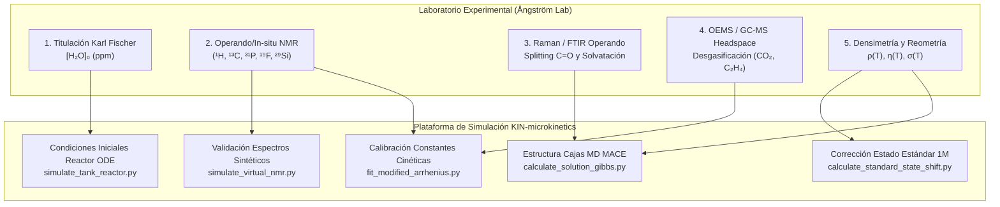

# [TFM-INF] Informe Técnico: Fisicoquímica del Sistema de Solventes EC/DMC y Especificación de Datos Experimentales para el Modelo Microcinético

**Proyecto:** TFM – Master's Thesis (*BatteryAsTank* / *KIN-microkinetics*)  
**Autor:** Yeray Alcaraz Galván  
**Supervisión:** Prof. Peter Broqvist (Ångström Laboratory, Universidad de Uppsala)  
**Fecha:** 22 de septiembre de 2026  
**Contexto:** Preparación previa a la visita técnica al laboratorio experimental de baterías (Ångström Lab) tras la reunión/café de alineamiento con Peter Broqvist.

---

## 1. Resumen Ejecutivo y Motivación

En la reunión informal de café de hoy (22-09-2026), Peter Broqvist destacó dos puntos estratégicos para el desarrollo del TFM:
1. **El benchmark del electrolito binario canónico ($\text{EC} + \text{DMC}$):** Mientras que el modelo de degradación del aditivo organosililado (**TMSPA**, benchmark [RXN-02](file:///Users/yerayalcarazgalvan/Library/CloudStorage/OneDrive-Uppsalauniversitet/TFM%20-%20Master%20Thesis/01%20-%20Reference%20material/BIB%20-%20Bibliographic%20research/RXN%20-%2002%20-%20Gogoi%20et%20al.%20-%20Reactivity%20of%20Organosilicon%20Additives%20with%20Water%20in%20Li-ion%20Batteries%20(2024).pdf)) nos permite calibrar el motor de ecuaciones diferenciales rígidas (ODE) y la espectroscopía sintética de $^{29}\text{Si}\text{ NMR}$, es fundamental dominar la matriz donde ocurre todo: el sistema de carbonatos cíclico/lineal **Carbonato de Etileno (EC)** y **Carbonato de Dimetilo (DMC)**.
2. **La transición del modelo teórico al laboratorio real:** En los modelos computacionales (DFT, dinámica molecular MACE o reactores ODE), solemos asumir una disolución homogénea continua a $298.15\text{ K}$. En el laboratorio físico existen restricciones de cambio de fase ($T_m(\text{EC}) \approx 36.4^\circ\text{C}$), protocolos térmicos ($\sim 40^\circ\text{C}$ para fundir el EC puro), pureza residual (trazas de $\text{H}_2\text{O}$ en ppm) y equilibrios de solvatación que determinan las condiciones iniciales exactas de nuestra simulación.

Este informe recopila:
- **Todo lo que necesitas saber sobre EC, DMC y solventes de baterías:** estructuras, propiedades termodinámicas, razones físicas de su combinación, comportamiento de fases y química de degradación.
- **La especificación exhaustiva de "Qué datos queremos del laboratorio":** categorizados por orden de prioridad, técnica analítica requerida y destino exacto dentro de nuestro pipeline de simulación (`KIN-microkinetics`).
- **Guía rápida de preguntas clave ("Cheat Sheet")** para interactuar con Peter y los experimentalistas durante la visita guiada.

---

## 2. Fundamentos Fisicoquímicos del Sistema de Solventes (EC / DMC)

### 2.1 Estructuras Moleculares y Topología

```
       [ Carbonato de Etileno (EC) ]                [ Carbonato de Dimetilo (DMC) ]
              Carbonato Cíclico                            Carbonato Lineal
                     O                                            O
                    //                                           //
                   C                                            C
                 /   \                                        /   \
               O       O                                    CH3-O   O-CH3
               |       |
              CH2 --- CH2
  -----------------------------------------    -----------------------------------------
  • Masa molar: 88.06 g/mol                    • Masa molar: 90.08 g/mol
  • Punto de fusión: +36.4 °C (SÓLIDO a TA)    • Punto de fusión: +2.5 °C (LÍQUIDO a TA)
  • Punto de ebullición: 248 °C                • Punto de ebullición: 90 °C (Volátil)
  • Constante dieléctrica (ε_r): 89.8 (40 °C)  • Constante dieléctrica (ε_r): 3.1 (25 °C)
  • Viscosidad dinámica (η): 1.90 mPa·s (40 °C)• Viscosidad dinámica (η): 0.59 mPa·s (25 °C)
  • Momento dipolar (μ): ~4.6 D                • Momento dipolar (μ): ~0.9 D
  • Densidad (ρ): 1.32 g/cm³ (40 °C)           • Densidad (ρ): 1.07 g/cm³ (25 °C)
```

### 2.2 ¿Por qué se mezclan? El compromiso Dieléctrico vs. Viscosidad

Ningún solvente puro cumple todos los requisitos exigidos a un electrolito de ion-litio comercial:
1. **Poder de disociación iónica ($\varepsilon_r$ alto):** Para disolver la sal de litio (comúnmente $\text{LiPF}_6$, $\text{LiFSI}$ o $\text{LiTFSI}$) y vencer la atracción culombiana entre cationes y aniones ($\Delta G_{\text{diss}} \propto -1/\varepsilon_r$), se requiere un medio altamente polar. El EC posee una de las permitividades relativas más altas de la química orgánica ($\varepsilon_r \approx 89.8$).
2. **Movilidad iónica y transporte de masa ($\eta$ baja):** La conductividad iónica molar ($\Lambda$) y el coeficiente de difusión del catión ($D_{\text{Li}^+}$) son inversamente proporcionales a la viscosidad dinámica del medio según las relaciones de Nernst-Planck y Stokes-Einstein:
   $$D = \frac{k_B T}{6 \pi \eta r_{\text{hyd}}}, \quad \sigma = \sum_i \frac{z_i^2 F^2 C_i D_i}{R T} \propto \frac{1}{\eta}$$
   El EC es excesivamente viscoso ($\eta \approx 1.90\text{ mPa}\cdot\text{s}$) e inutilizable a temperatura ambiente al ser un sólido.
3. **El Co-solvente fluidificante (DMC):** El DMC posee una viscosidad sumamente baja ($\eta \approx 0.59\text{ mPa}\cdot\text{s}$), permitiendo un transporte iónico ultra-rápido, pero su baja permitividad ($\varepsilon_r \approx 3.1$) provocaría una fuerte asociación iónica si se usase solo.

**Conclusión:** La mezcla binaria (típicamente $\text{EC}:\text{DMC}$ 1:1 en peso o 3:7 en volumen/peso, base del electrolito comercial canónico **LP30** con $1.0\text{ M LiPF}_6$) alcanza un óptimo físico: $\varepsilon_r \sim 30\text{--}40$ y $\eta \sim 1.0\text{ mPa}\cdot\text{s}$, garantizando tanto disociación como alta conductividad ($\sigma \approx 10\text{--}12\text{ mS/cm}$ a $25^\circ\text{C}$).

---

### 2.3 El Comportamiento de Fases y la "Regla de los 40 °C" en el Laboratorio

Uno de los detalles comentados por Peter en el café es el protocolo operativo del EC:
* **¿Por qué el EC es sólido a temperatura ambiente ($T_m = 36.4^\circ\text{C}$)?**  
  La molécula de EC es cíclica, rígida, muy compacta y tiene un momento dipolar elevado ($\sim 4.6\text{ D}$). Esto permite un empaquetamiento cristalino ortorrómbico muy eficiente con fuertes interacciones dipolo-dipolo en el sólido. En cambio, el DMC es acíclico, posee libre rotación alrededor de los enlaces $\text{C}-\text{O}$ de los grupos metoxi y su momento dipolar neto es bajo ($\sim 0.9\text{ D}$ debido a la conformación antiparalela casi simétrica), por lo que funde a $+2.5^\circ\text{C}$.
* **El protocolo experimental ($\sim 40^\circ\text{C}$):**  
  En el laboratorio, los botes de reactivo puro de EC llegan como un bloque blanco cristalino o ceroso. No se pueden pipetear ni dosificar volumétricamente a temperatura ambiente ($20\text{--}22^\circ\text{C}$). Es obligatorio introducirlos en una estufa o baño termostatizado a **$\sim 40^\circ\text{C}$** para licuarlos por completo antes de llevarlos a la caja seca (glovebox) o antes del pesaje.
* **Depresión eutéctica del punto de fusión:**  
  Una vez que el EC líquido se mezcla con DMC, la mezcla binaria experimenta una depresión crioscópica pronunciada. El diagrama de fases sólido-líquido $\text{EC}-\text{DMC}$ presenta un punto eutéctico por debajo de $-15^\circ\text{C}$ (e incluso $-20^\circ\text{C}$ dependiendo de la composición). Por tanto, **el electrolito final formulado permanece 100% líquido y estable a temperatura ambiente y subcero**, sin riesgo de precipitación en condiciones normales de ciclado.

---

### 2.4 Especiación y Esfera de Solvatación de $\text{Li}^+$

En disolución $1.0\text{ M LiPF}_6$ en $\text{EC}:\text{DMC}$, el ion $\text{Li}^+$ se coordina preferentemente con los átomos de oxígeno carbonílico ($\text{C}=\text{O}$):
* **Solvatación preferencial de EC:** Debido a su mayor número donador (Gutmann Donor Number: $DN_{\text{EC}} = 16.4\text{ kcal/mol}$ vs. $DN_{\text{DMC}} = 15.1\text{ kcal/mol}$) y mayor momento dipolar, el catión $\text{Li}^+$ atrae preferentemente moléculas de EC a su primera capa de solvatación (número de coordinación primario $CN \approx 4$). En una mezcla equimolar, la esfera de solvatación suele contener $3\text{--}4$ moléculas de EC y solo $0\text{--}1$ de DMC.
* **Especiación Iónica en función de la concentración:**
  1. **SSIP (*Solvent-Separated Ion Pairs*):** $[\text{Li}^+(\text{solvente})_4]\cdot\text{PF}_6^-$. El anión está libre y desapantallado en el medio. Predomina a concentraciones bajas/medias.
  2. **CIP (*Contact Ion Pairs*):** $[\text{Li}^+(\text{solvente})_3\text{PF}_6]$. El anión entra en contacto directo con el catión coordinándose a través de un flúor.
  3. **AGG (*Aggregates*):** $[\text{Li}_2(\text{solvente})_n\text{PF}_6]^+$, donde un anión $\text{PF}_6^-$ puentea dos cationes $\text{Li}^+$. Predomina a concentraciones elevadas ($> 1.5\text{ M}$).
* **Firma Espectroscópica (Raman/FTIR):**  
  La coordinación de $\text{Li}^+$ al oxígeno carbonílico polariza aún más el enlace $\text{C}=\text{O}$, provocando un desplazamiento hipsocrómico (hacia mayores frecuencias, *blue-shift*) en el estiramiento $\nu(\text{C}=\text{O})$ de $\sim 1770\text{--}1800\text{ cm}^{-1}$ (solvente libre) a $\sim 1805\text{--}1830\text{ cm}^{-1}$ (solvente coordinado a $\text{Li}^+$). Esto permite determinar experimentalmente la fracción de solvente libre vs. coordinado mediante deconvolución de picos.

---

### 2.5 Química de Degradación y Formación de la SEI

El sistema $\text{EC} + \text{DMC} + \text{LiPF}_6$ no es termodinámicamente inerte en el rango operativo de una batería de ion-litio ($0.0\text{--}4.5\text{ V}$ vs $\text{Li}/\text{Li}^+$):
1. **Formación de la SEI (*Solid Electrolyte Interphase*) en el ánodo:**  
   A potenciales inferiores a $\sim 0.8\text{ V}$ vs $\text{Li}/\text{Li}^+$, el EC experimenta reducción electroquímica uni-electrónica o bi-electrónica en la superficie de grafito:
   $$2\,\text{EC} + 2\,e^- + 2\,\text{Li}^+ \longrightarrow (\text{CH}_2\text{OCO}_2\text{Li})_2 \downarrow \text{ (LEDC)} + \text{C}_2\text{H}_4 \uparrow \text{ (Etileno)}$$
   El dicarbonato de dilitio etileno (LEDC) es el componente orgánico principal que forma una capa pasivante densa y protectora, impidiendo la exfoliación del grafito. El DMC reducido genera principalmente carbonato de dilitio metilo (LDMC) y gases como etano/metano, pero su capa es menos elástica y más soluble que la del EC.
2. **Ataque parásito por impurezas de humedad e hidrólisis de $\text{LiPF}_6$:**  
   La sal de litio se encuentra en equilibrio con el ácido de Lewis pentafluoruro de fósforo:
   $$\text{LiPF}_6 \rightleftharpoons \text{LiF} \downarrow + \text{PF}_5$$
   El $\text{PF}_5$ reacciona irreversiblemente con trazas de agua residual:
   $$\text{PF}_5 + \text{H}_2\text{O} \longrightarrow \text{POF}_3 + 2\,\text{HF}$$
   El $\text{HF}$ ataca la SEI, disuelve metales de transición del cátodo (ej. $\text{Mn}^{2+}$ en NMC) y ataca a los carbonatos abriendo sus anillos.
3. **Transesterificación (*Ester Exchange*):**  
   En presencia de trazas básicas de alcóxidos ($\text{RO}^-$) o en condiciones ácidas, los carbonatos lineales y cíclicos sufren transesterificación:
   $$\text{DMC} + \text{EC} \rightleftharpoons \text{Carbonatos asimétricos y oligómeros}$$
   Si existe presencia de carbonato de dietilo (DEC) o etanol, se observa la formación rápida de carbonato de etilmetilo (EMC: $\text{CH}_3\text{OCOOCH}_2\text{CH}_3$).
4. **Desgasificación (*Gassing*):**  
   Las rutas parásitas liberan gases: $\text{CO}_2$ (descarboxilación), $\text{C}_2\text{H}_4$ (reducción de EC), $\text{CH}_4$ (reducción de DMC) y $\text{POF}_3$ gaseoso volátil.

---

## 3. Matriz Estratégica: ¿Qué Datos Queremos del Laboratorio?

Para que nuestro motor de microcinética (`KIN-microkinetics` / `BatteryAsTank`) funcione con rigor cuantitativo y no como un mero ejercicio teórico abstracto, necesitamos solicitar a Peter y al equipo experimental del Ångström Lab datos medibles concretos.

A continuación se detalla la matriz de requerimientos organizada en 4 niveles de prioridad:



---

### Nivel 1: Condiciones Iniciales y Pureza de Reactivos (Crítico para el ODE)

Sin estos datos, el vector de concentraciones iniciales $\vec{C}_0$ en `simulate_tank_reactor.py` se convierte en una suposición arbitraria.

| Parámetro a Solicitar | Técnica Experimental | Unidades / Rango Típico | Destino en el Código (`KIN`) | Justificación Física |
| :--- | :--- | :--- | :--- | :--- |
| **Contenido exacto de humedad inicial $[H_2O]_0$** | Titulación Coulométrica Karl Fischer (KF) | $\text{ppm wt}$ (ej. $5\text{--}30\text{ ppm}$) $\to \text{mM}$ | `c0['H2O']` en `simulate_tank_reactor.py` | Es el reactivo limitante que dispara toda la cascada de degradación y consumo del aditivo TMSPA. |
| **Acidez residual inicial $[HF]_0$** | Titulación ácido-base no acuosa / Cromatografía iónica | $\text{ppm wt}$ (típico $< 20\text{ ppm}$) $\to \mu\text{M}$ | `c0['HF']` en `simulate_tank_reactor.py` | Determina la tasa de corrosión inicial y fluoración del aditivo a TMSF. |
| **Protocolo de mezcla del solvente $\text{EC}:\text{DMC}$** | Protocolo gravimétrico vs. volumétrico de balanza | $w/w$ o $v/v$ (ej. $1:1\text{ wt}$ vs. $3:7\text{ vol}$) | `c0['EC']`, `c0['DMC']` en el reactor | Con $50:50\text{ wt}\%$, las concentraciones molares difieren notablemente de $50:50\text{ vol}\%$ debido a las densidades ($1.32$ vs $1.07\text{ g/cm}^3$). |
| **Densidad real de la mezcla $\rho(T)$** | Picnometría o densímetro oscilante de tubo en U (Anton Paar) | $\text{g/cm}^3$ a $20, 25, 40, 60^\circ\text{C}$ | Cálculo de molaridad $[\text{mol/L}]$ y en `calculate_standard_state_shift.py` | Indispensable para transformar porcentajes en peso ($\text{wt}\%$) a concentraciones estándar molares ($C^* = 1.0\text{ M}$). |
| **Concentración real de aditivo $[TMSPA]_0$** | Pesaje analítico en caja seca ($\pm 0.1\text{ mg}$) | $\text{wt}\%$ (ej. $1.0\text{ wt}\% \approx 30\text{ mM}$) | `c0['TMSPA']` en `tmspa_microkinetics_reactor_model.ipynb` | Concentración del scavenger activo. |

---

### Nivel 2: Seguimiento Cinético Operando / In-situ (Crítico para Calibrar $k_j(T)$)

Estos datos permiten validar la integración numérica y ajustar las barreras de activación del principio Bell-Evans-Polanyi ($\Delta G^\ddagger = E_0 + \alpha \Delta G_{\text{rxn}}$).

| Parámetro a Solicitar | Técnica Experimental | Detalles Analíticos | Destino en el Código (`KIN`) |
| :--- | :--- | :--- | :--- |
| **Series temporales de concentración $C_i(t)$ por RMN** | RMN multinuclear in-situ / operando ($^1\text{H}, ^{13}\text{C}, ^{31}\text{P}, ^{19}\text{F}, ^{29}\text{Si}$) | Espectros adquiridos a intervalos de tiempo ($t = 0, 1, 2, 6, 12, 24, 48, 72\text{ h}$) | Comparación directa contra curvas $C(t)$ de Radau y validación de `simulate_virtual_nmr.py`. |
| **Control de Temperatura Isotérmica** | Sonda de temperatura RMN termostatizada ($25^\circ\text{C}, 40^\circ\text{C}, 60^\circ\text{C}$) | Cinéticas a mínimo 2 o 3 temperaturas diferentes | Ajuste de parámetros de Arrhenius modificados: $k(T) = A T^n e^{-E_a / RT}$ en `fit_modified_arrhenius.py`. |
| **Patrón interno cuantitativo de RMN** | Capilar coaxial con disolvente deuterado ($d_6\text{-DMSO}$, $\text{CD}_3\text{CN}$) + estándar (TMS, $\text{H}_3\text{PO}_4$ capillary, fluorobenceno) | **Pregunta clave:** ¿Cómo cuantifican en valor absoluto ($\text{mM}$)? El capilar evita que el solvente deuterado altere la química del electrolito. | Factor de escala de intensidad $I(\delta, t)$ en `simulate_virtual_nmr.py`. |
| **Desprendimiento de Gases en Tiempo Real** | OEMS (*Operando Electrochemical Mass Spectrometry*) o GC-MS de espacio de cabeza (*headspace*) | Tasas de liberación de $\text{CO}_2$ ($m/z = 44$), $\text{C}_2\text{H}_4$ ($m/z = 28$), $\text{CH}_4$ ($m/z = 16$), $\text{POF}_3$ ($m/z = 104$) en $\mu\text{mol}$ | Calibración de las reacciones de descomposición irreversible de solvente (R8 y R9 en `BatteryAsTank`). |

---

### Nivel 3: Solvatación y Estructura Local (Para MACE MD y DFT)

| Parámetro a Solicitar | Técnica Experimental | Información Extraíble | Destino en el Pipeline |
| :--- | :--- | :--- | :--- |
| **Espectros Raman / FTIR del carbonilo** | Espectroscopía Raman (láser 532 o 785 nm) / ATR-FTIR en caja seca | Desdoblamiento de la banda $\nu(\text{C}=\text{O})$ entre $1700\text{--}1850\text{ cm}^{-1}$ y anillo de EC ($\sim 717\text{ cm}^{-1}$ vs $728\text{ cm}^{-1}$). | Número de coordinación experimental ($CN_{\text{EC}}$ vs $CN_{\text{DMC}}$) para validar las cajas explícitas de MACE MD. |
| **Coeficientes de difusión autodifusión ($D_{\text{Li}^+}, D_{\text{PF}_6^-}, D_{\text{solvente}}$)** | PFG-NMR (*Pulsed Field Gradient NMR*) | Coeficientes de difusión individuales y número de transporte catiónico ($t_{\text{Li}^+} = \frac{D_{\text{Li}^+}}{D_{\text{Li}^+} + D_{\text{PF}_6^-}}$). | Parámetros de transporte para el modelo de tanque continuo CSTR / difusión interfacial. |

---

### Nivel 4: Propiedades Macroscópicas de Transporte

| Parámetro a Solicitar | Técnica Experimental | Rango Operativo | Destino en el Pipeline |
| :--- | :--- | :--- | :--- |
| **Viscosidad dinámica $\eta(T)$** | Reómetro rotacional de cono-plato o microviscosímetro de capilar sellado | $T \in [10^\circ\text{C}, 60^\circ\text{C}]$ | Ecuación de Stokes-Einstein en cinéticas controladas por difusión ($k_{\text{diff}} \approx \frac{8 R T}{3 \eta}$). |
| **Conductividad iónica $\sigma(T)$** | Celda de conductividad sellada hermética en caja seca (EIS) | $T \in [10^\circ\text{C}, 60^\circ\text{C}]$ | Calibración de parámetros de Vogel-Tamman-Fulcher (VTF). |

---

## 4. Guía Rápida de Preguntas para Peter y los Experimentalistas ("Cheat Sheet")

Durante la visita guiada por el Ångström Lab, te sugerimos formular estas preguntas directas y precisas. Demuestran un conocimiento profundo del sistema y van orientadas a conseguir los datos que nuestro código necesita:

### Bloque A: Formulación y Manejo de Solventes
1. *"¿Cómo preparan exactamente la mezcla $\text{EC}:\text{DMC}$ en la caja de guantes? ¿La formulan por masa ($w/w$) o por volumen ($v/v$)? Si es por volumen, ¿a qué temperatura miden el volumen del EC fundido?"*  
   *(Razón: Un cambio de temperatura en el EC de $40^\circ\text{C}$ a $25^\circ\text{C}$ altera su densidad de $1.32$ a $>1.35\text{ g/cm}^3$, introduciendo errores de molaridad si no se corrige).*
2. *"¿Disponen de mediciones precisas de densidad ($\rho$) del electrolito mezclado con $1.0\text{ M LiPF}_6$ en función de la temperatura ($20\text{--}60^\circ\text{C}$)? Las requerimos para la conversión de estado estándar gaseoso a solución $1.0\text{ M}$."*

### Bloque B: Control de Humedad e Impurezas
3. *"¿Qué nivel basal de humedad (en ppm por Karl Fischer) suelen medir en un lote fresco de electrolito comercial (LP30) y después de añadir aditivos? ¿Varía entre botellas recién abiertas y viales almacenados?"*  
   *(Razón: Este valor fija $[H_2O]_0$, el parámetro más sensible de todo el modelo ODE).*
4. *"¿Miden periódicamente la acidez libre ($[HF]$ residual) por titulación o cromatografía iónica? ¿Qué valor límite se considera aceptable antes de descartar un lote?"*

### Bloque C: Protocolo de Seguimiento Cinético por RMN
5. *"Para los experimentos de RMN in-situ donde siguen la degradación a lo largo de horas o días: ¿utilizan un inserto capilar coaxial sellado con el disolvente deuterado y el estándar de referencia para no perturbar la matriz del electrolito?"*
6. *"¿Qué estándar interno utilizan para el canal de $^{29}\text{Si}$ y $^{31}\text{P}$? ¿Podemos obtener los archivos crudos en formato FID o JCAMP-DX para procesar la deconvolución con nuestro script de RMN sintético (`simulate_virtual_nmr.py`)?"*
7. *"¿Realizan cinéticas a diferentes temperaturas controladas ($25^\circ\text{C}$, $40^\circ\text{C}$, $60^\circ\text{C}$)? Esto nos permitiría ajustar experimentalmente la energía de activación aparente ($E_a$) de las reacciones clave mediante regresión de Arrhenius modificada."*

### Bloque D: Estructura de Solvatación
8. *"¿Cuentan con datos de Raman o FTIR donde se aprecie claramente el pico del carbonilo libre vs. el coordinado a $\text{Li}^+$? Nos gustaría comparar el grado de coordinación de EC vs. DMC experimental con el que obtenemos en nuestras cajas de dinámica molecular con potenciales neuronales MACE."*

---

## 5. Mapeo Directo en el Repositorio `KIN-microkinetics`

Una vez recopilados los datos del laboratorio, así se integrarán en nuestro flujo de trabajo:

```
[Datos de Laboratorio]                      [Módulo Python en KIN-microkinetics]
──────────────────────                      ────────────────────────────────────
Karl Fischer [H₂O]₀ (ppm)              ──►  simulate_tank_reactor.py (c0['H2O'])
Titulación [HF]₀ (ppm)                 ──►  simulate_tank_reactor.py (c0['HF'])
Densidad ρ(T)                          ──►  calculate_standard_state_shift.py (ΔG*shift)
NMR Peak Areas vs t                    ──►  fit_modified_arrhenius.py (k_fwd(T), Ea)
NMR Chemical Shifts δ (ppm)            ──►  simulate_virtual_nmr.py (chem_shifts)
Raman Free/Bound EC ratio              ──►  calculate_solution_gibbs.py (Validación MACE)
OEMS Gas Evolution (μmol)              ──►  tmspa_microkinetics_reactor_model.ipynb (R8, R9)
```

---

*Documento archivado en:*
- [Repositorio KIN-microkinetics](file:///Users/yerayalcarazgalvan/Documents/GitHub/KIN-microkinetics/docs/INFORME_BENCHMARK_SOLVENTES_EC_DMC_Y_REQUISITOS_LABORATORIO.md)
- [OneDrive Master Thesis](file:///Users/yerayalcarazgalvan/Library/CloudStorage/OneDrive-Uppsalauniversitet/TFM%20-%20Master%20Thesis/01%20-%20Reference%20material/MET%20-%20Meetings%20&%20correspondence/INF%20-%202026-09-22%20-%20Guia%20Tecnica%20Solventes%20EC-DMC%20y%20Especificacion%20Datos%20de%20Laboratorio.md)
