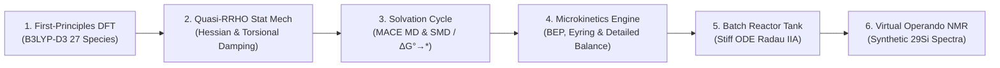

# Thermodynamics & Microkinetics $f(T)$

**Document Identifier:** `KIN - 260918 - Kinetics Model - Rev 1`  
**Author:** Yeray Alcaraz Galván  
**Affiliation:** Department of Chemistry – Ångström Laboratory, Uppsala University  
**Supervisor:**   
**Date:** September 18, 2026  
**Context:** Master's Thesis (TFM) — Chemical Engineering Pipeline from First-Principles DFT to Operando NMR Observables

---

This notebook establishes the complete multiscale pipeline connecting DFT calculations to macroscopic chemical kinetics and experimental validation:

$$\text{DFT / MACE-OMol Database} \longrightarrow \text{Quasi-RRHO Statistical Mechanics } f(T) \longrightarrow \text{Condensed-Phase Solvation Cycle} \longrightarrow \text{Microkinetics (BEP + Eyring)} \longrightarrow \text{Batch Reactor ("Tank")} \longrightarrow \text{Virtual }^{29}\text{Si NMR Spectrometer}$$



---

# Multiscale Pipeline

```text
Block 0: PHYSICAL CONSTANTS & CONVENTIONS
  │      Sets fundamental constants (R, kB, h, NA), standard states (1 bar, 1 M),
  │      and exact unit conversions (Hartree ↔ eV ↔ kcal/mol ↔ kJ/mol).
  ▼
Block 1: MOLECULAR INVENTORY (27 Species)
  │      Stores isolated species properties: molecular mass, 0 K DFT electronic energies (E_0K),
  │      EC solvation offsets (ΔE_solv), and experimental ²⁹Si NMR reference shifts.
  ▼
Block 2: TEMPERATURE BRIDGE (0 K → T, gas phase)
  │      Takes isolated molecules at 0 K and adds thermal motion at temperature T:
  │      G°_gas(T) = E_0K + H_thermal(T) - T · S_thermal(T)   [via Grimme Quasi-RRHO]
  ▼
Block 3: LIQUID SOLVENT BRIDGE (Gas 1 bar → Solution 1 M in EC)
  │      Plunges isolated gas molecules into polar liquid ethylene carbonate (EC):
  │      G_sol,i(T) = G°_gas,i(T) + ΔE_solv,i + ΔG°→*   [Flips 6 of 9 reactions to spontaneous!]
  ▼
Block 4: THE REACTION NETWORK & WEGSCHEIDER CONSISTENCY
  │      Wires the 27 species into 9 elementary reactions, computes ΔG_rxn and K_eq:
  │      ΔG_rxn = Σ G_sol(products) - Σ G_sol(reactants)
  │      Verifies closed thermodynamic loops sum strictly to zero: ΔG_loop ≡ 0.
  ▼
Block 5: MICROKINETIC RATE CONSTANTS (BEP + Eyring TST)
  │      Calculates reaction speed: forward rates k_f via Eyring TST + BEP barrier scaling:
  │      ΔG‡_f = max(E0, E0 + α · ΔG_rxn),  and reverse rates via detailed balance: k_r = k_f / K_eq.
  ▼
Block 6: MODIFIED ARRHENIUS PARAMETERIZATION (0 °C to 100 °C)
  │      Sweeps rate constants across battery temperatures and fits engineering Arrhenius parameters:
  │      k(T) = A · (T / T0)^β · exp(-Ea / RT)   [Standard format for Cantera / Aspen / Chemkin]
  ▼
Block 7: BATCH REACTOR DYNAMICS ("Tank" Stiff ODE Integration)
  │      Simulates real degradation kinetics in a batch electrolyte volume over time:
  │      dC/dt = S · r(C, T)   [Solved across 10⁻³ s to 10⁵ s via stiff implicit Radau IIA]
  ▼
Block 8: VIRTUAL OPERANDO SPECTROMETER (Synthetic ²⁹Si NMR)
  │      Converts simulated chemical concentrations C(t) into virtual ²⁹Si NMR spectra over time:
  │      Direct 1-to-1 synthetic observable for comparison with laboratory experimental NMR.
  ▼
Block 9: SENSITIVITY & SCAVENGER HALF-LIFE BENCHMARKING
         Sweeps moisture levels and intrinsic barriers (E0) to compute TMSPA consumption
         half-life (τ½) and evaluate battery shelf-life protection.
```

---

## Block 0: Physical Constants, Unit Conversions & Thermodynamic Conventions

### 1. Fundamental Physical Constants & Standard States
Microkinetic modeling in chemical engineering requires exact thermodynamic consistency across multiple unit systems (atomic units, electronvolts, SI units, and thermochemical kilocalories).

| Physical Constant | Symbol | Value (SI) | Value (Chemical / Atomic) |
|---|---|---|---|
| **Universal Gas Constant** | $R$ | $8.314462618\text{ J/(mol}\cdot\text{K)}$ | $1.987204\times 10^{-3}\text{ kcal/(mol}\cdot\text{K)}$ |
| **Boltzmann Constant** | $k_B$ | $1.380649\times 10^{-23}\text{ J/K}$ | $8.617333\times 10^{-5}\text{ eV/K}$ |
| **Planck Constant** | $h$ | $6.62607015\times 10^{-34}\text{ J}\cdot\text{s}$ | $4.135667\times 10^{-15}\text{ eV}\cdot\text{s}$ |
| **Speed of Light** | $c$ | $2.99792458\times 10^8\text{ m/s}$ | $2.99792458\times 10^{10}\text{ cm/s}$ |
| **Avogadro Constant** | $N_A$ | $6.02214076\times 10^{23}\text{ mol}^{-1}$ | — |
| **Standard Temperature** | $T^\circ$ | $298.15\text{ K}$ | $25.0\ ^\circ\text{C}$ |
| **Standard Gas Pressure** | $P^\circ$ | $10^5\text{ Pa}$ | $1.0\text{ bar}$ |
| **Standard Solute State** | $C^*$ | $1000.0\text{ mol/m}^3$ | $1.0\text{ mol/L (1.0 M)}$ |

### 2. Energy Conversion Factors
$$\begin{aligned}
1\text{ Hartree} &= 27.211386\text{ eV} = 627.509474\text{ kcal/mol} = 2625.4996\text{ kJ/mol} \\
1\text{ eV} &= 23.060548\text{ kcal/mol} = 96.485332\text{ kJ/mol} = 1.602176634\times 10^{-19}\text{ J} \\
1\text{ kcal/mol} &= 4.184\text{ kJ/mol} = 0.043364\text{ eV}
\end{aligned}$$

### 3. Detailed Balance & Microscopic Reversibility
In any closed thermodynamic network, forward and reverse rate constants are tied to the equilibrium constant:
$$K_{\text{eq}, j}(T) = \exp\left(-\frac{\Delta G_{\text{rxn}, j}(T)}{RT}\right) = \frac{k_{f, j}(T)}{k_{r, j}(T)}$$
This condition must hold identically across all temperatures to satisfy the Second Law of Thermodynamics.

---
## Block 1: First-Principles Quantum Chemistry & Solvation Database (27 Species)
**[Autogenerated block]**

### 1. The Chemistry of the TMSPA Scavenger in Battery Electrolytes
In lithium-ion cells with standard $\text{LiPF}_6$ / carbonate electrolytes, trace moisture contamination (typically $10\text{--}50\text{ ppm}$, corresponding to $C_{\text{H}_2\text{O}} \approx 2\text{--}20\text{ mM}$) triggers catastrophic decomposition:
$$\text{LiPF}_6 \rightleftharpoons \text{LiF} + \text{PF}_5$$
$$\text{PF}_5 + \text{H}_2\text{O} \longrightarrow \text{POF}_3 + 2\,\text{HF}$$
The released hydrofluoric acid (HF) dissolves the protective Solid Electrolyte Interphase (SEI) and leaches transition metals (Mn, Co, Ni) from the cathode.

**Tris(trimethylsilyl) phosphate (TMSPA)** is an electrochemically active sacrificial scavenger. It possesses three labile silicon-oxygen-phosphorus ($\text{P-O-Si}$) ester bonds. Because the silicon atom is oxophilic and electropositive, nucleophilic attack by water occurs preferentially on the $\text{Si}$ center rather than on $\text{PF}_5$:
$$\text{P-O-SiMe}_3 + \text{H}_2\text{O} \longrightarrow \text{P-O-H} + \text{Me}_3\text{Si-OH}$$
This converts destructive water into **trimethylsilanol (TMSOH)**, which subsequently undergoes autocatalytic condensation or silyl transfer into inert **siloxanes** and silylated glycols, effectively de-acidifying and drying the electrolyte.

### 2. The 27-Species Database from Peter
From the B3LYP-D3/def2-TZVP quantum chemistry dataset established by Prof. Peter Broqvist (`tank_model.ipynb`), we incorporate all 27 distinct molecular species spanning the complete degradation cascade:

1. **Organosilicon Phosphates & Siloxanes:**
   - `TMSPA`: Tris(trimethylsilyl) phosphate (starting additive, 3 Si atoms)
   - `BMSPA`: Bis(trimethylsilyl) hydrogen phosphate (primary hydrolysis intermediate, 2 Si atoms)
   - `MMSPA`: Mono(trimethylsilyl) dihydrogen phosphate (secondary hydrolysis intermediate, 1 Si atom)
   - `H3PO4`: Orthophosphoric acid (fully desilylated inorganic endpoint, 0 Si, 1 P)
   - `TMSOH`: Trimethylsilanol (labile silanol intermediate, 1 Si)
   - `siloxyl`: Hexamethyldisiloxane (inert condensation dimer, 2 Si)
   - `silicone`: Polydimethylsiloxane oligomer (higher condensation chain, 3 Si)
   - `TMS`: Tetramethylsilane (NMR reference, 1 Si)
   - `TMSOCH3`: Methoxytrimethylsilane (1 Si)
2. **Solvent, Carbonates & Decomposition Products:**
   - `EC`: Ethylene carbonate (bulk cyclic solvent, $\varepsilon \approx 90$)
   - `VC`: Vinylene carbonate (co-solvent / SEI film-forming additive)
   - `EO`: Ethylene oxide (cyclic ether decomposition product)
   - `VO`: Vinylene oxide (oxirene intermediate)
   - `CO2`: Carbon dioxide (volatile gas from carbonate ring-opening)
   - `EG`: Ethylene glycol
   - `VG`: Vinylene glycol
   - `H2CO3`: Carbonic acid
3. **Glycol Silyl Ethers (Solvent Attack Adducts):**
   - `TMSOEG`: 2-(trimethylsiloxy)ethanol (mono-silylated glycol, 1 Si)
   - `TMSOVG`: (vinyloxy)trimethylsilane (1 Si)
   - `TMSOdiEG`: 2-(2-(trimethylsiloxy)ethoxy)ethanol (di-glycol silyl ether, 1 Si)
4. **Volatile Gases & Hydrocarbons:**
   - `CH4`, `Ethane`, `Ethene`, `Ethyne`, `H2`, `O2`

### 3. The Solvation Data Contract

**[To check with Peter]**

For each species $i$, the data contract encapsulates:
- Electronic & gas free energy: $E_{\text{elec}}$ and $G^\circ_{\text{gas}}$ (Hartree, eV) from B3LYP-D3
- Condensed-phase solvation energy: $\Delta E_{\text{solv}}$ (eV) from explicit MACE-OMol MD in EC
- Nuclear parameters: Molecular weight ($g/\text{mol}$), rotational symmetry number $\sigma_{\text{rot}}$, principal moments of inertia ($I_A, I_B, I_C$), and harmonic vibrational normal modes ($\{\nu_k\}$)
- Spectroscopic observables: $^{29}\text{Si}$ and $^{31}\text{P}$ chemical shifts $\delta$ (ppm rel. TMS) and active nuclei multiplicities ($n_{\text{Si}}, n_{\text{P}}$)

---

## Block 2: Statistical Mechanics Engine & Grimme's Quasi-RRHO


### 1. The Finite-Temperature Bridge
Electronic structure calculations (MACE-OMol) evaluate the potential energy surface at $0\text{ K}$ in the absence of thermal motion. 

<pre>
   Total Molecular Motion (3N Degrees of Freedom)
                  │
   ┌──────────────┼──────────────┐
   ▼              ▼              ▼
  Translational    Rotational    Vibrational
   (3 Degrees)    (3 Degrees)   (3N−6 Degrees)
   │              │              │
 Sackur–Tetrode   Rigid Rotor    Harmonic Oscillator
  (Particle in    (Moments of    (Bond Springs
     a Box)        Inertia)      &amp; Quasi-RRHO)
</pre>

Molecular partition function:
$$Q(T) = q_{\text{trans}}(T) \cdot q_{\text{rot}}(T) \cdot q_{\text{vib}}(T) \cdot q_{\text{elec}}$$

*Expand the following tittles for details:*

1. **Translational Partition Function (Sackur–Tetrode):**

**Context: Translation of a poliatomic molecule with mass M, in an ideal box is the same as a monoatomic gas with mass M**

   * **Physical Role & COM Decoupling:** Describes 3D translation of the molecular Center of Mass (COM). Because $\hat{H}_{\text{tot}} = \hat{H}_{\text{COM}}(M) + \hat{H}_{\text{int}}$, any polyatomic molecule of mass $M$ translates as a single fictitious body of mass $M$. It provides the largest absolute entropy ($S_{\text{trans}} \propto \frac{3}{2}R\ln(MT)$). In associative steps ($A + B \to C$), 3 translational DoF are lost into vibrations, imposing a severe entropic penalty captured by Sackur–Tetrode.

   * **Original Formulation (Microcanonical / Phase Space):**
     Derived by Sackur (1912) and Tetrode (1912) via phase-space cell discretization ($h^{3N}$) with correct Boltzmann counting ($N!$) for a classical ideal gas of $N$ particles with internal energy $U$ and volume $V$ (Paños Expósito, 2014 [THM-01]):
     $$\frac{S}{k_B N} = \ln \left[ \frac{V}{N} \left( \frac{4\pi m}{3 h^2} \frac{U}{N} \right)^{3/2} \right] + \frac{5}{2}$$

   * **Key Transformations to Computational Canonical Form:**
     1. *Equipartition Theorem:* For 3 translational DoF ($x, y, z$), kinetic energy is $U = \frac{3}{2} N k_B T \implies \frac{U}{N} = \frac{3}{2} k_B T$.
     2. *Thermal de Broglie Wavelength:* Substituting $U/N$ defines $\Lambda = \frac{h}{\sqrt{2\pi m k_B T}}$, collapsing the expression to:
        $$\frac{S}{k_B N} = \ln \left( \frac{V}{N \Lambda^3} \right) + \frac{5}{2}$$
     3. *Ideal Gas Standard State ($P^\circ = 1\text{ bar}$):* Volume per particle $\frac{V}{N} = \frac{k_B T}{P^\circ}$ yields the single-particle partition function:
        $$q_{\text{trans}} = \frac{V}{N \Lambda^3} = \left( \frac{2\pi m k_B T}{h^2} \right)^{3/2} \frac{k_B T}{P^\circ}$$
     4. *Standard Molar Basis ($n = 1\text{ mol}, N = N_A$):* Since $R = N_A k_B$:
        $$H_{\text{trans}} = \frac{5}{2} R T, \quad S_{\text{trans}} = R \left( \ln q_{\text{trans}} + \frac{5}{2} \right)$$

   * **Assumptions & Limitations:**
     - *Ideal Gas Reference:* Assumes non-interacting point particles at $P^\circ = 1\text{ bar}$. In dense liquid electrolytes, translation is constrained by solvent cages (addressed via the Block 3 standard-state shift and solvation models).
     - *Classical Limit:* Valid only when $\frac{V}{N \Lambda^3} \gg 1$ ($T > 1\text{ K}$). As $T \to 0$, $S_{\text{trans}} \to -\infty$, violating the Third Law ($S(0\text{ K}) = 0$).

2. **Rotational Partition Function (Rigid Rotor):**

A mole is not an infinitesimal point of mass. It has spatial geometry, atoms are distributed around the mole center of mass. When a mole tumbles and spins in 3D space, its rotational kinetic energy is governed by its Angular Momentum


2 molecular geometries:

- Linear ($CO_2, H_2, etc.%)
The resistance to spinning along any axis is given by the moment of inertia tensor $I$, diagonalizing this $3 X 3% tensor yields the three principal moments of inertia $I_A <= I_B <= I_C$
  - Rotation around mole axis -> zero &I_A$
  - only 2 rotational DoF ($I_B=I_C$)
- Non-linear polyatomic molecules ($TMSPA, BMSPA, ...$)
  - All 3 orthogonal axes have non-zero inertia
  - 3 rotational DoF

Bulky mole with wide geometric spans (like TMSPA) have massive moments of inertia. This yields a large rotational partition function of rotational entropu


   For non-linear polyatomic molecules with principal moments of inertia $I_A, I_B, I_C$ and symmetry number $\sigma_{\text{rot}}$:
   $$q_{\text{rot}} = \frac{\sqrt{\pi}}{\sigma_{\text{rot}}} \left( \frac{8\pi^2 k_B T}{h^2} \right)^{3/2} \sqrt{I_A I_B I_C}$$
   $$H_{\text{rot}} = \frac{3}{2} R T, \quad S_{\text{rot}} = R \left( \ln q_{\text{rot}} + \frac{3}{2} \right)$$

3. **Vibrational Partition Function (Harmonic Oscillator)**

Internal relative movements of the atoms against each other

Vibrations are strictly quantum. At 0K, quantum uncertainty does not allow bonds to be completely motionless. At temperature $T$, thermal collisions excite higher vibrational levels

   $$E_{\text{ZPE}} = \sum_{k} \frac{1}{2} h c \nu_k, \quad U_{\text{vib}}(T) = R \sum_{k} \frac{\theta_{v, k}}{e^{\theta_{v, k}/T} - 1}$$
   where $\theta_{v, k} = \frac{h c \nu_k}{k_B}$.

### 2. The Low-Frequency Failure & Stefan Grimme's Quasi-RRHO (2012)
In the standard Harmonic Oscillator (HO) model, as vibrational frequency approaches zero ($\nu_k \to 0$), the vibrational entropy diverges logarithmically to infinity:
$$S_{\text{vib, HO}}(\nu_k) = R \left[ \frac{x_k}{e^{x_k} - 1} - \ln(1 - e^{-x_k}) \right] \xrightarrow{\nu_k \to 0} -R \ln(x_k) \to +\infty$$
For flexible organosilicon molecules such as TMSPA (which has three freely rotating $-\text{SiMe}_3$ groups and numerous low-frequency skeletal bending modes below $100\text{ cm}^{-1}$), standard HO severely overestimates entropy, creating unphysical thermodynamic errors exceeding $10\text{--}20\text{ kcal/mol}$.

To eliminate this, **Stefan Grimme's Quasi-RRHO** interpolation smoothly dampens low-frequency harmonic modes into 1D free rotors with effective moment of inertia $I_{\text{eff}} = \frac{\hbar}{4\pi c \nu_k}$:
$$S_{\text{free rot}}(\nu_k) = R \left[ \frac{1}{2} + \ln \sqrt{\frac{8\pi^3 I_{\text{eff}} k_B T}{h^2}} \right]$$
$$S_{\text{qRRHO}} = \sum_k \left[ w(\nu_k) S_{\text{vib, HO}}(\nu_k) + (1 - w(\nu_k)) S_{\text{free rot}}(\nu_k) \right]$$
using Head-Gordon damping weights:
$$w(\nu_k) = \frac{1}{1 + (\nu_0 / \nu_k)^4}, \quad \text{with cutoff } \nu_0 = 100\text{ cm}^{-1}$$


| Motion | Mathematical model | Parameter extracted from quantum/molecular data | Primary role in thermodynamic free energy $G(T)$ |
|---|---|---|---|
| Translation | Sackur–Tetrode | Molecular mass $m$ (g/mol) | Largest baseline entropy contribution, with $S_{\mathrm{trans}} \propto \frac{3}{2}R\ln(mT)$ |
| Rotation | Rigid rotor | Principal moments of inertia $(I_A, I_B, I_C)$ and symmetry number $\sigma_{\mathrm{rot}}$ | Accounts for molecular shape and spatial extent, with $S_{\mathrm{rot}} \propto \ln\!\left(\sqrt{I_A I_B I_C}/\sigma_{\mathrm{rot}}\right)$ |
| Vibration | Harmonic oscillator + Quasi-RRHO | Mass-weighted Hessian normal-mode frequencies $\{\nu_k\}$ | Provides quantum zero-point energy $E_{\mathrm{ZPE}}$ and thermal bond-excitation contributions $H_{\mathrm{vib}}(T)$ and $S_{\mathrm{vib}}(T)$ |

#### 1. Blue Curve: $\Delta H^\circ(T)$  
**Gas-phase enthalpy**, increasing from $0$ to approximately $+7.2\ \mathrm{kJ/mol}$ relative to $273.15\ \mathrm{K}$.

**Physical interpretation**

When a gas is heated, its molecules absorb sensible heat:

$$
\Delta H^\circ(T)=\int_{T_0}^{T} C_p(T)\,dT
$$

Because $C_p>0$, the thermal energy increases through:

- Translational motion: $+\frac{5}{2}RT$
- Rotational motion: $+\frac{3}{2}RT$
- Quantum vibrational excitation of chemical bonds

Therefore, the relative enthalpy increases as temperature rises.

#### 2. Green Curve: $S^\circ_{\mathrm{qRRHO}}(T)$  
**Entropy**, increasing from approximately $338.4$ to $358.5\ \mathrm{J/(mol\cdot K)}$.

**Physical interpretation**

Entropy measures the number of energetically accessible molecular microstates:

$$
S=k_\mathrm{B}\ln W
$$

At $0\,^\circ\mathrm{C}$, high-frequency vibrational modes remain predominantly in their quantum ground states. As the temperature increases to $100\,^\circ\mathrm{C}$, low-frequency modes—and, to a lesser extent, higher-frequency modes—acquire greater populations in excited vibrational levels:

$$
v=1,2,\ldots
$$

More translational, rotational, and vibrational microstates become accessible. Consequently, the entropy increases smoothly with temperature.

#### 3. Red Dashed Curve: $\Delta G^\circ(T)$  
**Relative Gibbs free energy**, decreasing from $0$ to approximately $-34.2\ \mathrm{kJ/mol}$.

**Physical interpretation**

The plotted quantity is relative to the value at $273.15\ \mathrm{K}$:

$$
\Delta G^\circ(T)=G^\circ(T)-G^\circ(T_0)
$$

By definition:

$$
G(T)=H(T)-T\,S(T)
$$

At constant pressure:

$$
\left(\frac{\partial G}{\partial T}\right)_P=-S
$$

Although the enthalpy increases with temperature, the entropic term $-T S$ becomes substantially more negative. Using the approximate entropy range

$$
S\approx 350\ \mathrm{J/(mol\cdot K)}
=0.350\ \mathrm{kJ/(mol\cdot K)},
$$

the entropy contribution changes by approximately

$$
-\Delta(TS)\approx -0.350\times 100
\approx -35\ \mathrm{kJ/mol}.
$$

The enthalpy increase partially offsets this change by approximately $+7.2\ \mathrm{kJ/mol}$. Therefore, the net relative Gibbs free-energy change is approximately

$$
\Delta G^\circ \approx +7.2-41.4
\approx -34.2\ \mathrm{kJ/mol}.
$$

Thus, the Gibbs free energy decreases even though the molecule absorbs heat, because the increasing entropic contribution dominates.

**Interpretation:**
- For rigid/small molecules (like HF) low entropy -> G falls slowly
- For felxible/big molecules (like TMSPA) high entropy -> G falls fast

### Summary Block 2

```text
DFT / MACE Input (0 K, Static)                                           Block 2 Output: f(T) (Dynamic)
┌────────────────────────────────────────────┐                          ┌────────────────────────────────────────────┐
│ • Electronic energy: E₀K (eV)              │                          │ • Standard enthalpy: H°(T)                 │
│ • Molecular mass: M (g/mol)                │ --------------------->   │ • Absolute entropy: S°(T)                  │
│ • Moments of inertia: I_A, I_B, I_C        │                          │ • Gibbs free energy: G°(T)                 │
│ • Harmonic frequencies: {ν₁, …, ν₃N−6}     │                          │ • Gas-phase standard-state properties      │
└────────────────────────────────────────────┘                          └────────────────────────────────────────────┘
                         
                                            Statistical-mechanics engine
                                            Translation + rotation + quasi-RRHO vibration
                         
```

**Assumptions:**

1. Factorization of molecular DoF
    - Hamiltionian is assumet to be as independent motions: total = trans + rot + vib + elec
    - Trans, rot, and vibration do not couple with each other

2. Electronic ground state [I don't undesrtand it]
    - e- adjusts instantaneously to nuclear positions
    - No electronic excitation
    - $q_elec = 1, S_elec = R\ln(1)=0$

3. Ideal Gas & Sackur-Tetrode (translation)
    - Model: particle in a 3D box at $P^º=10^5Pa
    - Assumption: molecules don't interact in gas-phase. [????]

4. Rigid rotor aprox.
    - Model: molecule rotates as an undeformable rigid body around $I_x$
    - Assumptions: 
        1. No centrifugal stretching
        2. Hight-temp classical limit $(T>>\theta_rot)$
        3. Rotational symmetry number $(\sigma_rot)$

5. Harmonic oscilator (HO) and zero-point energy (vibration)
    - Model: potential energy surface near the geometry minimum is approx as a multiD parabola: $V(x)\approx \frac{1}{2}kx^2$
    - Assumptions:
        1. Ignores bond softening or dissociation at high vibrational amplitudes
        2. ZPE: even at T=0K, $ZPE=\sum 1/2 h\nu_i$

6. Quasi-RRHO

Flexibl molecules (like TMSPA) have very low-frew torsional vibrations. in standar oscillator entropy -> $\infty$. An small numerical inaccuracy in DFT inflates the entropy considerably, ruining $G(T)$

RRHO blends the harmonic oscillator with a free rotor formula using a continous damping function

 - High frequency ($nu > 100 cm^-1$, streches/bends) $\rightarrow$ Pure Harmonic Oscillator
 - Low frequency ($nu < 100 cm^-1$, methyl torsions) $\rightarrow$ Free Rotor limit
 - **Result:** completely eliminates the entropy singularity


> **IMPORTANT**
> This block calculates gas-phase properties at $P^º=1bar$). But a bettery is a liquid electrolyte.

---

## Block 3: Solvation Thermochemistry & Solvation-Driven Reaction Free Energies

### 1. The Liquid-Phase Thermodynamic Cycle
Reactions in battery cells occur not in vacuum, but in a:
- dense,
- polarizable, 
- liquid electrolyte mixture. 

The standard Gibbs free energy of solute species $i$ in solution is formulated rigorously via the thermodynamic cycle:

$$G_{\text{sol}, i}(T) = G^\circ_{\text{gas}, i}(T) + \Delta E_{\text{solv}, i} + \Delta G^{\circ \to *}(T)$$


```
Gas Phase:      Reactants (g, 1 bar)  ───────────────►  Products (g, 1 bar)
                       │                                       │
            -ΔG°→* - ΔE_solv(R)                     +ΔG°→* + ΔE_solv(P)
                       ▼                                       ▼
Solution Phase: Reactants (soln, 1 M) ──────────────►  Products (soln, 1 M)
```

1. **Standard-State Concentration Compression ($\Delta G^{\circ \to *}$):**
   Converts the standard state from an ideal gas at $P^\circ = 1\text{ bar}$ ($C^\circ_{\text{gas}} = P^\circ / (RT) = 0.04034\text{ mol/L}$ at $298.15\text{ K}$) to the solution standard state ($C^* = 1.0\text{ mol/L}$):
   $$\Delta G^{\circ \to *}(T) = RT \ln\left( \frac{C^*}{C^\circ_{\text{gas}}(T)} \right) = RT \ln\left( \frac{R T}{P^\circ} \cdot 1000 \right) = +1.894\text{ kcal/mol} \ (+7.925\text{ kJ/mol at } 298.15\text{ K})$$
   
   **Chemical Engineering Invariant:** For any equimolar reaction step (where moles of products equal moles of reactants, $\Delta n = \sum \nu_{\text{prod}} - \sum \nu_{\text{reac}} = 0$):
   $$\sum_p \Delta G^{\circ \to *} - \sum_r \Delta G^{\circ \to *} = \Delta n \cdot \Delta G^{\circ \to *} = 0$$
   *Because all 9 reactions in our benchmark network have $\Delta n = 2 - 2 = 0$, the standard-state compression cancels out identically!*

2. **Condensed-Phase Solvation Energy ($\Delta E_{\text{solv}}$):**
   Computed via explicit NVT/NPT molecular dynamics sampling with **MACE-OMol** neural network interatomic potentials in liquid ethylene carbonate (EC), complemented by SMD continuum reaction fields.

### 2. The Driving Force: Solvation Flips 6 Out of 9 Reactions
A fundamental discovery from Peter Broqvist's research is that **gas-phase DFT is completely inadequate for predicting battery degradation**:
In vacuum, all primary TMSPA hydrolysis steps ($R_1, R_2, R_3$) are endergonic ($\Delta G^\circ_{\text{gas}} > 0$), suggesting that TMSPA would be thermodynamically unreactive toward moisture.
However, because water, silanols (TMSOH), and partially deprotected phosphate acids ($	ext{BMSPA}, 	ext{MMSPA}, 	ext{H}_3	ext{PO}_4$) possess strong dipoles and hydrogen-bonding capabilities, they undergo massive solvation stabilization in high-dielectric EC ($\varepsilon_{\text{EC}} \approx 90$).

This solvation stabilization shifts $\Delta G_{\text{rxn}}$ by up to $-25\text{ kcal/mol}$, **flipping 6 out of 9 reactions from endergonic (unfavorable) to exergonic (highly spontaneous)!**

EC has a $\epsilon_{EC} \approx 90$ (dielectric permeability)
 - EC is a solid cristal at room temp
 - $T_m=36,4ºC$
 
To ger a liquid at room temp (or sub-0) it is formulated as a binary mixture with **DMC**

* pure EC $\epsilon_{EC} \approx 90$
* pure DMC $\epsilon_{DMC} \approx 3.1$
* (1:1) mixture $\epsilon_{eff} \approx 30-40$

> **Next step:**
> 
> Calculate with EC+DMC mixture
>

---

## Block 4: Reaction Network Thermodynamics & The Wegscheider Consistency

### 1. The 4 Mechanistic Reaction Classes
The benchmark reaction network (`RXN-02`, Gogoi et al. 2024 / Peter Broqvist) organizes the 9 wired elementary steps into 4 chemical categories:

1. **Sequential Hydrolysis ($R_1, R_2, R_3$):**
   Successive displacement of trimethylsilyl groups by water molecules:
   $$\begin{aligned}
   R_1: &\quad \text{TMSPA} + \text{H}_2\text{O} \rightleftharpoons \text{BMSPA} + \text{TMSOH} \quad (\Delta G = -0.440\text{ eV} / -10.15\text{ kcal/mol}) \\
   R_2: &\quad \text{BMSPA} + \text{H}_2\text{O} \rightleftharpoons \text{MMSPA} + \text{TMSOH} \quad (\Delta G = -0.154\text{ eV} / -3.55\text{ kcal/mol}) \\
   R_3: &\quad \text{MMSPA} + \text{H}_2\text{O} \rightleftharpoons \text{H}_3\text{PO}_4 + \text{TMSOH} \quad (\Delta G = -0.195\text{ eV} / -4.50\text{ kcal/mol})
   \end{aligned}$$
   All three steps are exergonic in solution.

2. **Silanol Condensation & Autocatalytic Water Regeneration ($R_4$):**
   Trimethylsilanol undergoes self-condensation to form unreactive hexamethyldisiloxane:
   $$R_4: \quad 2\,\text{TMSOH} \rightleftharpoons \text{siloxyl} + \text{H}_2\text{O} \quad (\Delta G = +0.183\text{ eV} / +4.22\text{ kcal/mol})$$
   **Key Kinetic Implication:** $R_4$ regenerates water back into the electrolyte! Thus, even a trace amount of water ($20\text{ mM}$) acts autocatalytically, continually regenerating to hydrolyze further equivalents of TMSPA until the scavenger is depleted.

3. **Direct Silyl Transfer ($R_5, R_6, R_7$):**
   TMSOH can directly attack intact phosphate silyl esters, transferring the silyl group to form siloxyl without requiring free water:
   $$\begin{aligned}
   R_5: &\quad \text{TMSPA} + \text{TMSOH} \rightleftharpoons \text{BMSPA} + \text{siloxyl} \quad (\Delta G = -0.257\text{ eV} / -5.93\text{ kcal/mol}) \\
   R_6: &\quad \text{BMSPA} + \text{TMSOH} \rightleftharpoons \text{MMSPA} + \text{siloxyl} \quad (\Delta G = +0.029\text{ eV} / +0.67\text{ kcal/mol}) \\
   R_7: &\quad \text{MMSPA} + \text{TMSOH} \rightleftharpoons \text{H}_3\text{PO}_4 + \text{siloxyl} \quad (\Delta G = -0.012\text{ eV} / -0.28\text{ kcal/mol})
   \end{aligned}$$

4. **Solvent Attack & Gassing ($R_8, R_9$):**
   TMSOH and silylated glycols nucleophilically attack cyclic ethylene carbonate, inducing ring-opening and releasing gaseous carbon dioxide:
   $$\begin{aligned}
   R_8: &\quad \text{EC} + \text{TMSOH} \longrightarrow \text{TMSOEG} + \text{CO}_2\uparrow \quad (\Delta G = -0.449\text{ eV} / -10.35\text{ kcal/mol}) \\
   R_9: &\quad \text{EC} + \text{TMSOEG} \longrightarrow \text{TMSOdiEG} + \text{CO}_2\uparrow \quad (\Delta G = -0.980\text{ eV} / -22.60\text{ kcal/mol})
   \end{aligned}$$
   This accounts for electrolyte gassing and cell pouch expansion during aging.

---

### 2. Intuitive Meaning of the Wegscheider Consistency Condition (Cyclic Detailed Balance)
 
 - **Path 1 (Two-stage trail):** ($[\text{TMSPA} + \text{H}_2\text{O} + \text{TMSOH}]$) downhill to B via $R_1$ (hydrolysis), then climb slightly over C via $R_4$ (condensation).  
 - **Path 2 (Direct ridge trail):** Directly from A to C via $R_5$.  
 
 ($[\text{BMSPA} + \text{siloxyl} + \text{H}_2\text{O}]$), **the net change in elevation (potential energy) must be identical**  
 Complete the loop by returning to A (Path 1 minus Path 2), net change is identically zero:
 $$\oint dG = \Delta G(R_1) + \Delta G(R_4) - \Delta G(R_5) \equiv 0$$
 In terms of equilibrium constants:
 $$\frac{K_{\text{eq}}(R_1) \cdot K_{\text{eq}}(R_4)}{K_{\text{eq}}(R_5)} = 1.000000$$
 
 **What happens if a model violates this?**  
 If $\Delta G_{\text{loop}} \neq 0$, the reaction loop would act like an unphysical **"chemical perpetual motion machine"**, generating free energy out of nowhere as molecules cycle around the loop in the dark!

---

### 3. Dual Thermodynamic Evaluation & How to Choose `mode`
In the code below, we evaluate the entire reaction network under both thermodynamic engines:

| Criteria | `mode = 'b3lyp_benchmark'` | `mode = 'qRRHO'` |
|---|---|---|
| **Underlying Physics** | Static B3LYP-D3/6-311G** reference ($298.15\text{ K}$) | Full statistical mechanics: Sackur-Tetrode + Rigid Rotor + Grimme damped vibrations |
| **Solvation State Shift** | Omitted (matches original `tank_model.ipynb`) | Explicit $RT \ln(C^*/C^\circ_{\text{gas}})$ concentration compression |
| **Best Used For** | **Validation & Literature Benchmarking:** Exact replication of Peter Broqvist's baseline results | **Predictive Discovery & Temperature Sweeps:** When exploring non-ambient temperatures ($0^\circ\text{C}$ to $100^\circ\text{C}$) or new chemistries |
| **Wegscheider Closure** | $\Delta G_{\text{loop}} = +2.04\times 10^{-10}\text{ kJ/mol}$ | $\Delta G_{\text{loop}} = -7.28\times 10^{-10}\text{ kJ/mol}$ |

> **User Option:** At the bottom of the code cell, you can set `selected_mode = 'b3lyp_benchmark'` or `selected_mode = 'qRRHO'` to choose which set of thermodynamic values feeds downstream blocks.

**Limitations**

1. Omission of the salt ($LiPF_6$)
  - $Li^+$ is a strong Lewis acid that coordinates with carbonyl oxygens of EC and the $P=O$ of TMSPA. 
  - Lewis acid coordination can significantly lower reaction barriers or change rection free energies.

2. Ideal dilute solution assumption $\gamma_i=1$    
   - [to be explained]

3. Solvation energy approximations
    - $\Delta E_{solv}$ are treated as constant energy offsets
    - Solvent free energy can be temp-dependent. As temp increase: solvent thermal disorder increases, and dielectric permeavility drops (check Onsager relation)

---

## Block 5: Microkinetics & Rate Constants Engine with Strict Detailed Balance

Block 5 bridges equilibrium thermodynamics and dynamic reaction engineering. It converts static reaction free energies ($\Delta G_{\text{rxn}}$) and equilibrium constants ($K_{\text{eq}}$) from Block 4 into dynamic, finite forward and reverse rate constants ($k_f(T)$ and $k_r(T)$) across all 9 elementary reaction steps using Transition State Theory (Eyring):

$$k_f(T) = \frac{k_B T}{h} \exp\left( -\frac{\Delta G^\ddagger_f(T)}{RT} \right)$$

where $\frac{k_B T}{h} \approx 6.212 \times 10^{12}\text{ s}^{-1}$ at $298.15\text{ K}$ represents the fundamental attempt frequency.

- **Inputs (from Block 4):**
  - Reaction free energies: $\Delta G_{\text{rxn}, j}(T)$
  - Equilibrium constants: $K_{\text{eq}, j}(T) = \exp\left(-\frac{\Delta G_{\text{rxn}, j}}{RT}\right)$
  - Reaction families: hydrolysis, condensation, silyl transfer, solvent attack
  - Reactor temperature: $T$ (K)
- **Outputs (to Blocks 6 and 7):**
  - Kinetic rate constant vectors: $\mathbf{k}_f(T), \mathbf{k}_r(T)$
  - Forward and reverse activation barriers: $\Delta G^\ddagger_f(T), \Delta G^\ddagger_r(T)$

```text
Block 4 Input: Thermodynamics                                           Block 5 Output: Microkinetics
┌────────────────────────────────────────────┐                          ┌────────────────────────────────────────────┐
│ • Reaction free energy: ΔG_rxn(T) [eV/kJ]  │                          │ • Forward rate constants: k_f(T) [s⁻¹, M⁻¹s⁻¹]│
│ • Equilibrium constants: K_eq(T)           │ ─────────────────────>   │ • Reverse rate constants: k_r(T) [s⁻¹, M⁻¹s⁻¹]│
│ • Reaction families (4 classes)            │                          │ • Forward barriers: ΔG‡_f(T) [eV, kJ/mol]  │
│ • Reactor temperature: T (K)               │                          │ • Reverse barriers: ΔG‡_r(T) [eV, kJ/mol]  │
└────────────────────────────────────────────┘                          └────────────────────────────────────────────┘
                                                     │
                                                     ▼
                              ┌──────────────────────────────────────────────┐
                              │     Transition State Theory (Eyring TST)     │
                              │       k(T) = (kB·T / h) · exp(-ΔG‡ / RT)     │
                              └──────────────────────┬───────────────────────┘
                                                     │
                       ┌─────────────────────────────┴─────────────────────────────┐
                       ▼                                                           ▼
         ┌───────────────────────────┐                               ┌───────────────────────────┐
         │ MODEL 1: BEP Linear       │                               │ MODEL 2: Marcus Quadratic │
         │ ΔG‡_f = max(E₀, E₀+αΔG)   │                               │ ΔG‡_f = (λ/4)(1 + ΔG/λ)²  │
         │ • E₀ = 0.80 eV (intrinsic)│                               │ • λ = 4·E₀ = 3.20 eV      │
         │ • α = 0.50 (Brønsted)     │                               │ • Continuous curvature    │
         └─────────────┬─────────────┘                               └─────────────┬─────────────┘
                       │                                                           │
                       └─────────────────────────────┬─────────────────────────────┘
                                                     │
                                                     ▼
                              ┌──────────────────────────────────────────────┐
                              │   Strict Detailed Balance (Microreversibility)│
                              │           k_r(T) = k_f(T) / K_eq(T)          │
                              │          ΔG‡_r = ΔG‡_f - ΔG_rxn              │
                              └──────────────────────────────────────────────┘
```

---

### 5.1. Models

1. **Bell-Evans-Polanyi (BEP) Linear Scaling:**
   Assumes activation barriers scale linearly with reaction free energy within each reaction family:
   $$\Delta G^\ddagger_f = \max\left( E_0,\, E_0 + \alpha \Delta G_{\text{rxn}} \right)$$
   - $E_0 = 0.80\text{ eV}$: Intrinsic barrier when $\Delta G_{\text{rxn}} = 0$ (benchmark from Peter Broqvist, `tank_model.ipynb`).
   - $\alpha = 0.50$: Brønsted coefficient for a symmetric transition state.
   - Capping at $E_0$ via $\max$ prevents unphysical zero or negative barriers for strongly exergonic steps ($\Delta G_{\text{rxn}} \ll 0$).

2. **Marcus Theory Quadratic Activation:**
   Models intersecting parabolic energy surfaces of reactants and products, introducing quadratic curvature:
   $$\Delta G^\ddagger_f = \frac{\lambda}{4} \left( 1 + \frac{\Delta G_{\text{rxn}}}{\lambda} \right)^2$$
   - $\lambda = 4 E_0 = 3.20\text{ eV}$: Reorganization energy calibrated to match BEP intrinsic barrier ($E_0 = 0.80\text{ eV}$) and slope ($\alpha = 0.50$) at $\Delta G_{\text{rxn}} = 0$.
   - Provides a continuously differentiable ($C^\infty$) curvature without the sharp derivative discontinuity of linear capping.

3. **Strict Detailed Balance (Microscopic Reversibility):**
   Enforced on both models to guarantee thermodynamic consistency and zero net flux at equilibrium:
   $$\Delta G^\ddagger_r(T) = \Delta G^\ddagger_f(T) - \Delta G_{\text{rxn}}(T)$$
   $$k_r(T) = \frac{k_B T}{h} \exp\left( -\frac{\Delta G^\ddagger_r(T)}{RT} \right) = \frac{k_f(T)}{K_{\text{eq}}(T)}$$
   This guarantees that forward and reverse rates balance identically at equilibrium ($r_f = r_r$) and prevents artificial perpetual-motion cycles (Wegscheider condition).

---

### 5.2. The Intrinsic Activation Barrier ($E_0$) & Estimation Methods

The intrinsic barrier $E_0$ is the activation free energy when a reaction is thermoneutral ($\Delta G_{\text{rxn}} = 0$). Because rate constants depend exponentially on barrier height ($k \propto e^{-E_0/RT}$), $E_0$ sets the absolute timescale of the simulation: every $0.06\text{ eV}$ change at $298.15\text{ K}$ shifts reaction rates by one order of magnitude.

$E_0$ can be determined via three complementary methods:
1. **First-Principles / Quantum Mechanics (DFT & MLIP):** Transition State (TS) search via Nudged Elastic Band (NEB) or dimer algorithms locating the exact first-order saddle point on the potential energy surface.
2. **Computational Literature & Analogs:** Transferable barriers from high-level benchmark calculations on structurally related reaction families (e.g. silyl ester substitution, cyclic carbonate ring-opening).
3. **Experimental Calibration:** Fitting $E_0$ family-by-family against time-resolved laboratory observables (e.g. operando $^{29}\text{Si}$ NMR consumption rates or OEMS $CO_2$ gas evolution).

---

## Block 6: Temperature-Dependent Kinetics: Modified Arrhenius Fitting & Van 't Hoff Analysis

### 1. The Modified Arrhenius Equation in Chemical Engineering
Standard Arrhenius kinetics assumes a constant pre-exponential factor ($k = A e^{-E_a/RT}$). However, in modern chemical reaction engineering (Cantera, Chemkin, Aspen Plus), rate constants across broad temperature windows are parameterized via the **Modified Arrhenius Equation**:

$$k_j(T) = A_j \left( \frac{T}{T_0} \right)^{\beta_j} \exp\left( -\frac{E_{a, j}}{RT} \right)$$

- $A_j$: Frequency factor at reference temperature $T_0 = 298.15\text{ K}$ ($s^{-1}$ or $M^{-1}s^{-1}$)
- $\beta_j$: Temperature exponent capturing non-Arrhenius curvature. Because the Eyring attempt frequency is proportional to $T$ ($\frac{k_B T}{h}$), $\beta \approx 1.0$. Deviations reflect temperature-dependent activation heat capacity ($\Delta C_p^\ddagger$) and solvent cage restructuring.
- $E_{a, j}$: Activation energy (kJ/mol or eV).

### 2. Regression Algorithm
Taking the natural logarithm:
$$\ln k_j(T) = \ln A_j + \beta_j \ln\left( \frac{T}{T_0} \right) - \frac{E_{a, j}}{R} \left( \frac{1}{T} \right)$$
This forms a 3-parameter linear regression system $\mathbf{X} \mathbf{\theta} = \mathbf{Y}$, solved via Ordinary Least Squares across $T \in [273.15, 373.15\text{ K}]$.

### 3. Van 't Hoff Equation for Equilibrium
The temperature dependence of the equilibrium constant follows the Van 't Hoff relation:
$$\frac{d \ln K_{\text{eq}}}{d (1/T)} = -\frac{\Delta H^\circ_{\text{rxn}}}{R}$$
Exothermic steps ($\Delta H < 0$) exhibit downward slopes, favoring reactants as temperature increases, whereas endothermic steps exhibit upward slopes.

---

## Block 7: Homogeneous Batch Reactor Dynamics ("Tank" Stiff ODE Integration)

### 1. Chemical Reactor Governing Equations
The degradation of electrolyte additives in an isothermal, homogeneous batch reactor ("Tank") is governed by the mass balance equation:

$$\frac{d\mathbf{C}}{dt} = \mathbf{S} \cdot \mathbf{r}(\mathbf{C}, T)$$

- $\mathbf{C} = [C_1, C_2, \dots, C_{N_s}]^T$ is the species concentration vector (mol/L)
- $\mathbf{S} \in \mathbb{R}^{N_s \times N_r}$ is the stoichiometric matrix
- $\mathbf{r}(\mathbf{C}, T) \in \mathbb{R}^{N_r}$ is the net reaction flux vector:
  $$r_j = k_{f, j}(T) \prod_{r \in \text{reac}} C_r^{\nu_{rj}} - k_{r, j}(T) \prod_{p \in \text{prod}} C_p^{\nu_{pj}}$$

### 2. Numerical Stiffness & Implicit Radau IIA Integration
The system exhibits extreme numerical stiffness: the fastest reactions (e.g. forward hydrolysis, $k_f \sim 0.2\text{ s}^{-1}$) occur on a timescale of seconds, while solvent decomposition and silanol equilibration evolve over hundreds of hours ($t \sim 10^6\text{ s} \approx 11.5\text{ days}$).

Explicit ODE integrators (e.g. standard Runge-Kutta RK45) undergo numerical explosion unless time steps are restricted to $\Delta t < 10^{-6}\text{ s}$, requiring $> 10^{12}$ steps. We employ the **Radau IIA** algorithm (implicit 5th-order Runge-Kutta with adaptive time stepping via [`scipy.integrate.solve_ivp`](https://docs.scipy.org/doc/scipy/reference/generated/scipy.integrate.solve_ivp.html), based on Hairer & Wanner's RADAU5), which provides unconditional $L$-stability.

### 3. Invariant Conservation Laws & Operating Conditions
- **Silicon Conservation:** $\sum_i n_{\text{Si}, i} C_i(t) = 3 C_{\text{TMSPA}}(0) = 150.0\text{ mM} \equiv \text{constant}$
- **Phosphorus Conservation:** $\sum_i n_{\text{P}, i} C_i(t) = C_{\text{TMSPA}}(0) = 50.0\text{ mM} \equiv \text{constant}$
- **Initial Conditions from Peter Broqvist:**
  - $C_0(\text{TMSPA}) = 50.0\text{ mM}$ ($5\text{ wt}\%$ scavenger additive)
  - $C_0(\text{H}_2\text{O}) = 20.0\text{ mM}$ ($36\text{ ppm}$ trace moisture contamination)
  - $C_0(\text{EC}) = 4500.0\text{ mM}$ ($4.5\text{ M}$ bulk solvent, buffered constant reservoir)

---

## Block 8: Virtual Operando Spectrometer: Synthetic $^{29}\text{Si}$ NMR Time Evolution

### 1. The Virtual Spectroscopy Bridge
To directly validate our chemical engineering microkinetic model against experimental laboratory data, we project the dynamic reactor concentration vector $\mathbf{C}(t)$ into synthetic **$^{29}\text{Si}$ NMR spectra**.

### 2. Physical NMR Parameters
From DFT GIAO calculations (`thermo_H2O.ipynb` / Peter Broqvist), isotropic magnetic shieldings ($\sigma_{\text{iso}}$) relative to tetramethylsilane (TMS, $\sigma_{\text{TMS}}$) yield chemical shifts $\delta$:
$$\delta_i = \sigma_{\text{TMS}} - \sigma_{\text{iso}, i}$$

The active nuclei count per molecule ($n_{\text{Si}, i}$) provides the exact stoichiometric signal intensity weighting:
- **TMSPA:** $\delta = -19.86\text{ ppm}$, $n_{\text{Si}} = 3$ (three equivalent trimethylsilyl groups)
- **BMSPA:** $\delta = -18.01\text{ ppm}$, $n_{\text{Si}} = 2$
- **MMSPA:** $\delta = -17.58\text{ ppm}$, $n_{\text{Si}} = 1$
- **TMSOH:** $\delta = -15.57\text{ ppm}$, $n_{\text{Si}} = 1$
- **siloxyl:** $\delta = -6.92\text{ ppm}$, $n_{\text{Si}} = 2$ (characteristic downfield peak)
- **TMSOEG:** $\delta = -18.01\text{ ppm}$, $n_{\text{Si}} = 1$
- **TMSOdiEG:** $\delta = -19.11\text{ ppm}$, $n_{\text{Si}} = 1$

### 3. Lorentzian Convolution
Experimental NMR spectra exhibit natural Lorentzian broadening governed by transverse spin-spin relaxation ($T_2$):
$$I(\delta, t) = \sum_{i \in \text{Si species}} n_{\text{Si}, i} \, C_i(t) \cdot \frac{(\text{FWHM}/2)^2}{(\delta - \delta_i)^2 + (\text{FWHM}/2)^2}$$
where $\text{FWHM} = \text{LW} = 0.8\text{ ppm}$ corresponds to typical experimental linewidths in battery electrolytes.

---

## Block 9: Parameter Sensitivity & Scavenger Half-Life Benchmarking

### 1. Sensitivity to the Intrinsic Activation Barrier $E_0$
In the Bell-Evans-Polanyi formulation, the intrinsic activation barrier $E_0$ serves as the primary physical tuning parameter governing the overall timescale of scavenger activity.

To understand how intrinsic bond strength governs shelf-life and moisture scavenging speed, we perform a systematic parametric sweep over $E_0 \in [0.60, 1.00\text{ eV}]$:
- At $E_0 = 0.60\text{ eV}$, TMSPA is consumed in less than 1 hour (rapid scavenger).
- At $E_0 = 0.80\text{ eV}$ (Peter Broqvist's benchmark), scavenger half-life is $\sim 20\text{--}50\text{ hours}$, providing sustained protection over weeks.
- At $E_0 = 1.00\text{ eV}$, the barrier is too high, resulting in sluggish scavenging where moisture persists for weeks.
